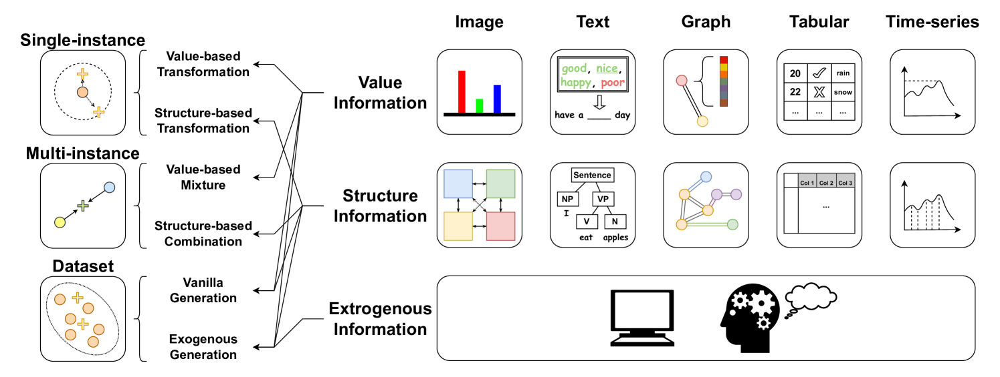

# Introduction to Data Augmentation

>Ref:
>https://arxiv.org/html/2405.09591v3

## Introduction

>To solve these problems, data augmentation has been extensively applied and proven to be effective and efficient [8]. The core idea of data augmentation is **to artificially enlarge the training dataset by creating modified copies of existing data. It also introduces more diversity and fills the gap between training datasets and real-world applications.** 
>As technology continues to evolve, a variety of techniques are applied to augment data samples. Some simple approaches only randomly mask part of the data [9, 10, 11], while more sophisticated augmentation schemes involve generative adversarial networks [12] or reinforcement learning agents [13].

## Taxonomy

一个标记过的数据集 $D_L=\{X,y\}$ ，$X$ 表示数据，$y$表示标签。数据增广可以被一个特定的函数$f_\theta$表示。增广得到的数据集 $\tilde{D}_L=\{\tilde{X},\tilde{y}\}$ 被如下导出：

$$
f_\theta:\mathcal{D}_L=\{X,y\} \rightarrow \tilde{\mathcal{D}}_L=\{\tilde{X},\tilde{y}\}
$$

它同样可以表示未标记的数据集 $\mathcal{D}_U = \{ \mathbf{X} \}$ 或者一个部分标记的数据集 $\mathcal{D}_P = \{ \mathbf{X}_L \cup \mathbf{X}_U, \mathbf{y}_L \}$。但是为了方便，我们使用标记过的数据集解释分类。有一些数据增广方法应用在数据输入空间中，另有一些则应用在隐性的特征空间中。本节使用$X$作为一个空间无关的表示方式。

本文提供一个两级的分类体系，它基于以数据为中心的视角提出，并适用于所有数据模态。
该分类体系的主要考量是：增广信息中的信息来源于何处。该体系通过两个研究问题来区分不同的数据增广技术：
- RQ1：生成每个新样本使用了多少原始样本
- RQ2：生成新数据时使用了哪一部分信息

通过回答RQ1，我们可以将其分为三类：
- 单样本级增广 Single-instance Level Augmentation
- 多样本级增广 Multi-instance Level Augmentation
- 数据集级增广 Dataset Level Augmentation

这构成了分类体系的第一层级。

**单样本级别增广**通过对单个数据样本进行变换来生成新数据，而不依赖其他样本。它通常对数据产生某种扰动，比如遮蔽或者添加噪声。新数据的信息完全来源于元数据集的某一个样本，因此每个新样本在特征空间中通常位于原始样本附近。
形式化如下：

$$
\tilde{\mathbf{x}} = \mathbf{x}_i + \epsilon(\mathbf{x}_i), \quad \tilde{y} = y_i
$$

其中$\mathbf{x}_i$表示与原始数据$x_i$相关的某种扰动。

---

进一步回答RQ2，来建立分层体系的第二层。我们需要考虑信息在数据中的承载方式。
通常，数据由某种类型的元素构成，他们携带数值信息，比如像素的颜色或橘子中的词语。对于大多数数据还存在某种结构信息用于连接他们，例如像素之间的位置关系或者橘子的语法结构。

设计数据增广方法的核心即思考如何巧妙地利用这两类信息。因此，根据所使用的信息类型，将单样本级增广方法进一步分类为：

- 基于数值的变换 Value-based Transformation
  对元素携带的数值信息进行扰动
- 基于结构的变换 Structure-based Transformation
  对元素之间的结构关系进行扰动

---

**多样本级增广**通过组合多个数据样本信息来生成新样本，常见的操作包括插值与拼接。由这些方法生成的新样本通常在特征空间中位于原始样本之间的位置。
其形式化如下:

$$
\tilde{\mathbf{x}} = \lambda \cdot \mathbf{x}_i + (1 - \lambda) \cdot \mathbf{x}_j, \quad \tilde{y} = \lambda \cdot y_i + (1 - \lambda) \cdot y_j
$$

其中 $i$,$j$是原数据集中的两个样本，$\lambda$为一个介于 $[0,1]$的标量因子。

类似的，回答问题R2也带来如下分类：
- 基于数值的混合 Value-based Mixture
- 基于结构的组合 Structure-based Combination

---

**数据集级增广**不直接使用一个或者多个具体样本，而是利用整个数据集来生成新数据。他通过学习数据集的特征和抽象表示，采样出全新的数据。这些生成的数据应当符合原始数据集的分布。形式化如下：

$$
\tilde{\mathbf{x}} \sim P(\mathbf{X}), \quad \tilde{y} \sim P(y \mid \tilde{\mathbf{x}})
$$

其中，$P(·)$ 表示自从原始数据集中学习得到的概率分布。

对于数据集级增广，我们对RQ2的回答和前两类方法有所不同。此类方法生成新数据时，通常考虑数值信息和结构信息，因为他们从整个数据集的分布中学习并采样。此外，一些方法还要引入外部知识。因此我们将其进一步划分为以下两类：

- 原生生成 Vanilla Generation
  仅依赖于现有数据集进行生成。
- 外源生成 Exogenous Generation
  在生成过程中引入外部资源，如其他数据集或专家知识。

---

我们已经从高层次展示了一个通用的数据增广分类体系，并进行了抽象和概念上的形式化。

## ...

## Discussions

>Up to now this survey focuses on wherefrom the information in the augmented samples is derived. And there are many other perspectives to discuss data augmentation and understand how it works.

### Augmentation Evaluation Metrics

>Two of the most critical metrics are **affinity** and **diversity**
>最具代表性的两项指标是亲和度与多样性

**亲和性** *Affinity*亦可称为一致性、正确性、忠实度、质量、相似性或有效性。它反映增强样本是否在语义上与原始样本保持一致，并保留原始标签。
以模型为中心的估计中将亲和性定义为模型$m$在增广验证集 $D'_{val}$ 和原始验证集的性能比值。

$$
affinity = ACC(m,D'_{val}) / ACC(m,D_{val})
$$

其中 $ACC(m,D)$ 表示模型 $m$ 在评估集 $D$ 上的性能表现。
另一方面，以数据为中心的评估将亲合度定义为：增广数据集在特征空间中与原始数据集的偏差程度。

比如原文参考[214]提出Fréchet BERT Distance (FBD)来评估两个文本数据集的偏差。其定义为：

$$
FBD = \sqrt{\lVert m_1-m_2\lVert^2_2 + Tr(C_1+C_2-2(C_1C_2)^{1/2})}
$$

其中，$m$ 为平均向量，$C$为协方差矩阵。

---

**多样性** *Diversity*反映了数据集中模式的广度，让模型接触多样化的训练数据集可提升其鲁棒性。

[218]将数据集视为椭球体，并将其多样性定义为椭球体的等轮廓半径：

$$
diversity = (r_1·r_2·...·r_H)^{\frac{1}{H}} = \sqrt[H]{\prod^H_i \sigma_i}
$$

[219] 提出通过计算离散度来评估数据集多样性：

$$
diversion = \sum_{x_1,x_j} d(x_i,x_j)
d(x_i,x_j) = 1 - \frac{f(x_i)f(x_j)}{\lVert f(x_i) \lVert \lVert f(x_j) \lVert}
$$

一些实证研究（包括[219]、[217]和[215]）探讨了亲和度和/或多样性如何影响数据增强的有效性，其实际实验结果表明，模型性能最能受益于同时实现高亲和度和多样性的数据增强方案。

## VII-C  Augmented Samples

>Early data augmentation methods rely on hand-craft manipulations, which are constrained by effectiveness and efficiency. AutoAugment [13] begins to introduce reinforcement learning to find optimal augmentation policies, enabling automatic search for desired augmentation strategies. Generative models, such as LLMs and diffusion models, possess outstanding capacities to capture sample semantics and produce new samples with high flexibility and high quality [234, 162, 122]. However, data augmentation is sometimes only a preprocessing step in a deep learning framework, and introducing generative models might introduce extra computation overhead. **How to balance the tradeoff between the reward and cost of using these advanced techniques remains an open but critical problem.**

