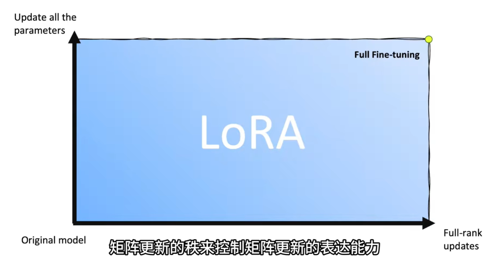

# Low Rank Adaptation

低秩分解主要用于模型fine-tuning.
- 我们是否需要找到所有的参数？
- 对于微调的权重矩阵，更新在矩阵秩上应该有多大的表现力

这两个问题都可以对应图上的一个位置。如果我们追求更新全部参数，以及满秩，即全面精调。

## 矩阵原理

$d$ 维满秩方阵$W$可以表示 $R^d$中的任意向量。

$$
XW = X'
$$

其中,$W$ 的参数量为 $d^2$
如果我们将$R^d$中的向量先放缩到较短的维度$r$,$r<<d$，再将其变换回$d$维，如下:

$$
X
\begin{bmatrix}
\vec{c_1} &\vec{c_2} &...& \vec{c_r}
\end{bmatrix}_{d \times r}
= X_{\text{r}},
$$

其中 $\vec{c_i}$ 为 $d$ 维列向量, 
将其变换回 $R^d$

$$
X_r 
\begin{bmatrix}
\vec{r_1} \\
\vec{r_2} \\
... \\
\vec{r_r} \\
\end{bmatrix}_{r \times d} = X'
$$
其中，$r_i$为 $d$ 维行向量。
两个矩阵总共需要的参数量为: $2 \times r \times d$

## 使用情景

只要模型使用矩阵乘法，我们就可以问出开篇的两个问题。

在 GPT-3 上，LoRA将 *175,000,000,000* 个参数精简为 *4,700,000* 个，从 1TB减少到25MB。

## 当我们在讨论秩，我们在讨论什么

秩衡量了信息的自由度。低秩意味着冗余，如果一个1000x1000的权重矩阵rank只有50，这说明大多数参数都是多余的。
高秩意味着丰富性，注意力矩阵的秩越高，token的交互模式就越多样，而不会退化为几个固定的注意力模式。

一个极端的例子是，注意力点积矩阵的两行完全相同。这意味着，token1对其他token的关系与token2与其他token的关系完全相同。这两个token的关注模式完全重复，这就是注意力模式的退化。理想情况下每个token都应该有自己独特的注意力分布。

LoRA将一个矩阵拆分为 $A · B$ 两个更小的矩阵，因为往往整个矩阵存在很多冗余。LoRA也可以视为一种信息的压缩。