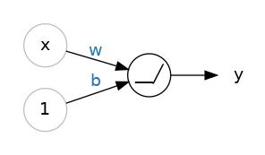

# DL小结与拓展

## 有关Neuron的视角

the linear Unit: $y=wx+b$


x作为输入，我们视输入与神经元进行连接，并带有权重weight。当值随着连接流入神经元，使用值与**权重**相乘。
b是一个特殊的权重，称之为偏移bias。b确保了神经元可以独立于输入地自我调整输出。

每个神经元实则都在做这样的运算：
$z = w_1x_1+w_2x_2+...+b$
即根据自身权重与所有与之连接的输入相乘相加。
随后这个值被投入激活函数向后传递，并视为与下一层神经元连接，作为下一层神经元的输入。

一个神经元的学习，即修改自身**权重**的过程。

## 有关Layer的视角

多层的核心思想是**模块化**，使用简单的小单元建立复杂的网络。一个线性单元只计算一个线性函数，但通过组合和修改，我们可以建立更复杂的关系。


神经网络的每一层都可以视作是在进行某种相对简单的变换。通过好几层神经元的叠加，一个神经网络将它的输入以更加更加复杂的方式进行变换。对于一个训练良好的网络而言，每一层都是向目标答案更进一步的变换。

如果只是以线性方式叠加若干层，我们能够进行的变换也仍是线性的，模型本身只能学习线性关系，无法超脱于线与平面。我们需要一些非线性的变换，于是引入激活函数。



比如应用一个ReLu函数，将权重之和投入ReLu，得到一个简单的非线性关系。

## 有关Optimize

在使用Loss函数评估了预测值与事实值的差距后，Optimizer优化器负责如何优化参数。事实上深度学习中使用的所有优化算法都同属一个族：随机梯度下降Stochastic Gradient Descent。不同的梯度下降策略各有区别。一个优秀的的optimizer是Adam算法。
> sto-chastic，随机的。

## 梯度下降过程与信息论

在梯度下降的过程中，我们经常画出学习曲线Learning Curves观看损失函数随epoch的下降。我们可以考虑的更多一些。

我们可以把训练集中的数据看做两种类型：**信号**signal与**噪声**noise。所谓信号，即能够泛化推广的部分，让模型预测更接近真实情况。所谓噪声，即只能在训练集上成立的部分。

噪声来源于真实世界中数据的随机波动，或者偶发的、不带有信息的，对模型预测无用的模式。他是看起来有用，但实际上没用的部分。

模型通过选择权重/参数最小化训练集上的loss而训练。然而要评估模型的准确性，我们仍需要在验证集上作进一步评估。


我们在验证集上做出validation loss，随epoch画出曲线。

训练集上曲线一直降低，不管学习了信号还是噪声。验证集上曲线只在学习**信号**时降低。(因为训练集上习得的噪声无法**泛化**到新数据上。如果能那就不叫噪声了。)

---

模型学习了**信号**时，两条曲线一同降低。可学习了**噪声**时，两条曲线之间的间隔产生了。间隔的大小告诉了你这一模型学习噪声的大小(有多少没法泛化)。

理想情况下，我们想让模型只学信号，不学噪声，实际中这显然是不可能的。所以我们折中一下，让模型以学习噪音为代价的同时学习信号。
只要学的信号更多，validation曲线就仍会下降，直到转折点。转折点后曲线上升，意味着我们当前学习的噪声已经多于信号。

这一**信息论**观点给欠拟合和过拟合提供了新的解释。
如果学习的信号不够多，则会欠拟合。如果学习的噪声过多，则会过拟合。因此我们需要找到最佳平衡。

## Capacity

一个模型的容量capacity指他能够学习pattern的大小与复杂程度。对于神经网络而言，这很大程度取决于有多少神经元，以及他们如何连接。如果你的神经元总是欠拟合，那就试试提高容量吧。

要提升capacity，你可以让他更宽，即层级中添加更多神经元。或者让他更深，即添加更多的层级。

网络越宽，越能学习**线性关系**。网络越深，越能学习**非线性关系**。(激活函数在深度方向传递)
哪个更好只取决于数据集。

## Early Stopping

如果模型学的噪声太多，validation曲线就会升高。我们可以简单地停留在曲线不再下降的位置。
一旦我们检测到验证集曲线开始升高，我们就将参数重置为上次最小值发生处。这保证模型不会继续学习噪声继而过拟合。你可以更细致的决定在什么情况下停止。

```
early_stopping = EarlyStopping(
    min_delta=0.001, # minimium amount of change to count as an improvement
    patience=20, # how many epochs to wait before stopping
    restore_best_weights=True,
)
```

几个参数的含义是：如果在20个epoch内，验证集损失没有降低至少0.001，那就停止，并保留最好的参数。

实际情况里，验证集学习曲线可能忽高忽低，因此要选择良好的早停策略。

## Dropout

除了dense layer，还有很多种其他层。

前文提到，模型过拟合的原因是学习过程中学习到了太多噪声。一个模型要认识到一个噪声的模式要依赖好几个神经元参数之间的组合。这就好比是几个神经元之间形成的阴谋，而只要拿掉其中一个就可以化解。这就是Drop Out的思想，随机的拿掉几个神经元，破坏噪声pattern的学习，而期望他学习更通用的模式。

你也可以认为dropout创建了几个小神经网络的集合，让不同的几个小网络协同作用，而不是一整个大网络发挥作用。这种零碎的小网络会倾向于犯不同的错，但同时做对事情。这与随机森林采用几颗决策树的集合是同一个道理。

```
keras.Sequential([
    # ...
    layers.Dropout(rate=0.3), # apply 30% dropout to the next layer
    layers.Dense(16),
    # ...
])
```

指定一个百分比决定撤掉多少部分。

## Batch Normalization

我们喜欢处理位于相同尺度的数据。如果在数据投喂进网络之前把他们归一化是个好主意，那么在网络中间也这么做也肯定不错。于是我们提供了batch normalization layer，在层级之间归一化。

>*A batch normalization layer looks at each batch as it comes in, first normalizing the batch with its own mean and standard deviation, and then also putting the data on a new scale with two trainable rescaling parameters. Batchnorm, in effect, performs a kind of coordinated rescaling of its inputs.*

实际上还有另一种归一化叫Layer Normalization。