# Visual Information Theory

## Introduction

>I love the feeling of having a new way to think about the world. I especially love when there’s some vague idea that gets formalized into a concrete concept. Information theory is a prime example of this.

>Information theory gives us precise language for describing a lot of things. How uncertain am I? How much does knowing the answer to question A tell me about the answer to question B? How similar is one set of beliefs to another?

## Visualizing Probability Distributions

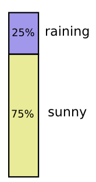 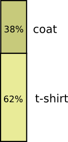

这是两个概率分布，在独立的情况下，我们如下图将其同时考量。

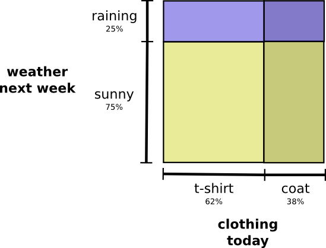

穿外衣的概率不会影响下雨的概率。他们并不交叉，其同时发生的概率为两者乘积。

而当变量相互关联，某两对变量就可能产生或损失额外的概率。如下图。

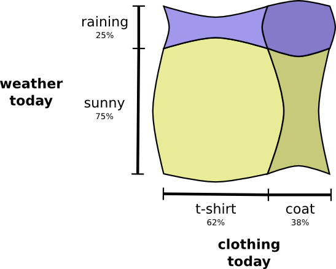

---

我们先暂时只考虑一个变量，比如天气。

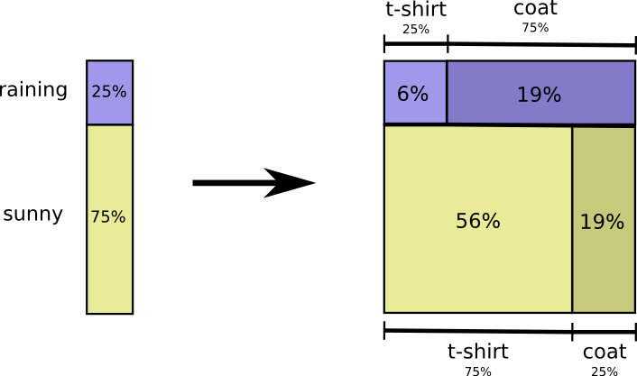

不管下雨还是晴天，我们考虑**条件概率**：晴天时你有多大概率穿T恤，下雨时你有多大概率穿外衣？

如果有25%概率下雨，下雨时有75%概率穿外套。那么下雨时你穿外套的概率为：
$$
25\% \times 75\% = 19\%
$$

即：

$$
p(rain,coat) = p(rain) · p(coat|rain)
$$

即概率论中最基础的一例：

$$
p(x,y) = p(x)·p(y|x)
$$

我们将其拆分为两个部分的乘积。
首先我们看一个变量的概率，例如天气，取一特定值。然后取另一个变量，例如穿衣服，但取一个受到前一概率影响的值。你可以随意先取哪个。

比如我们可以先关注穿衣服的情况，再看天气受其的影响。虽然这不太符合直觉(天气受到穿衣服影响)，但仍然有效。

另一个例子是：
取随机的一天，有38%的概率你会穿外套。
如果我们已知你穿了外套，有多大可能在下雨？
假设穿外套时下雨的概率是50%，那么：

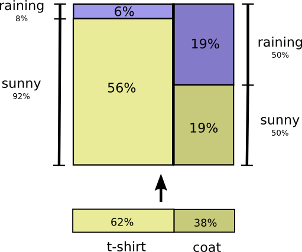

$$
p(rain,coat) = p(coat)·p(rain|coat)= \\
38\% \times 50\% = 19\%
$$

在这张图中，T-shirt和coat是边际概率(marginal probabilities)，即在不考虑天气因素下穿衣服的概率。

>You may have heard of Bayes’ Theorem. If you want, you can think of it as the way to translate between these two different ways of displaying the probability distribution!

### Simpson悖论

辛普森悖论是一个极端不符合直觉的统计学悖论。

一项研究对肾结石的两种疗法做测试，其中一半的病人采用疗法A，另一半采用疗法B。结果显示，接受疗法B的更容易存活。

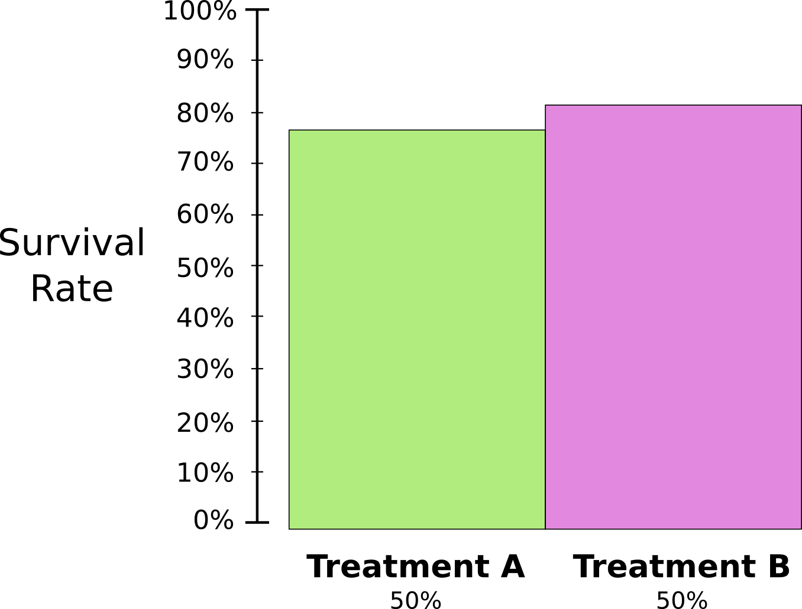

然而，肾结石较小的患者，采用疗法A更容易存活。同时，肾结石较大的患者采用疗法A也更容易存活。怎么会事呢？

问题在于这项研究没有进行适当的随机分组。接受疗法A的患者很可能患有大块肾结石，而接受治疗B的患者更可能患有小块肾结石。

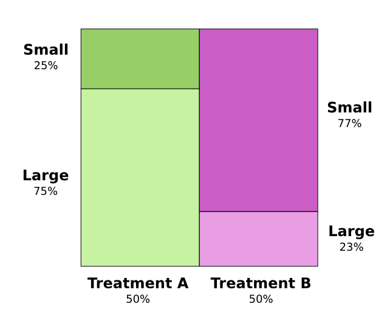

如图所见分布不均。事实证明，肾结石较小的患者更容易存活。

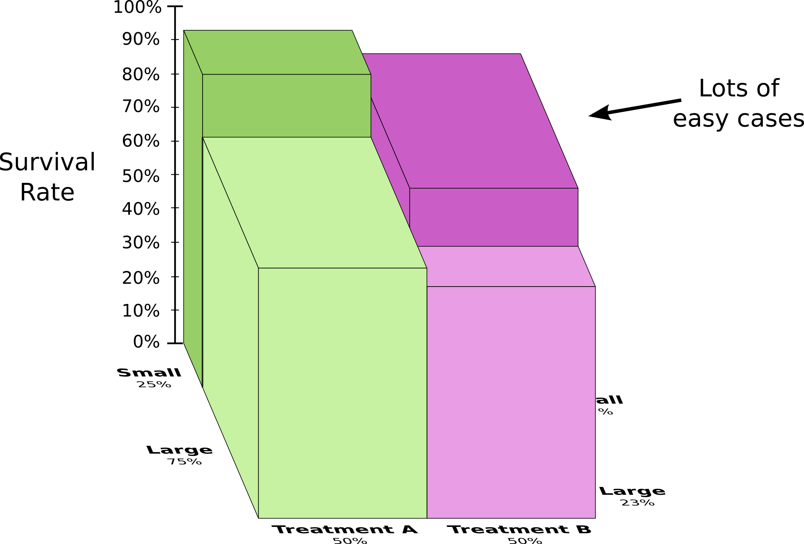

我们将其转换为3d视角。如图，不管是小结石还是大结石，疗法A都胜过疗法B。疗法B看起来更好只是因为被分到了更多的小结石患者，他们本来就更容易存活。

## Codes

现在我们可以可视化概率了，该看看信息论了。

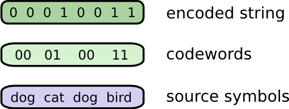

假设Bob非常喜欢动物，它不停地和你说“dog”, “cat”, “fish” 和 “bird”。如果我们用二进制沟通，那么将单词编码，进而得到一个经编码的字串。

### Variable-Length Codes

假设通信成本很贵，我们能不能找到更好的方法来削减平均信息长度呢？

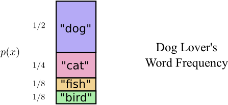

实际上，Bob说这些词的频率不是均等的。Bob喜欢dog，所以它说的最多。如图，我们可以得到它说这些词的频率。

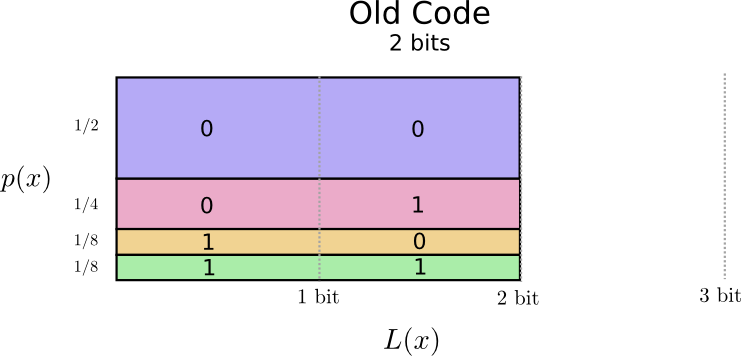

我们如图衡量编码的平均长度，即它的面积，2bits。
如果我们足够聪明，那应该能想到用变长编码。让最常用的词的长度最小。

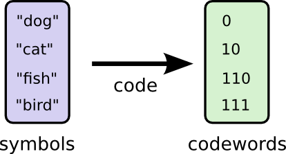 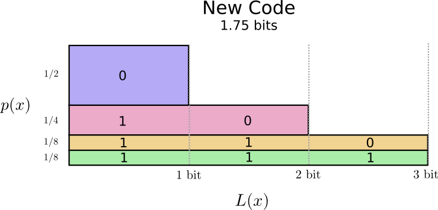

现在我们削减了面积，只有1.75bits。
>图例中我们没有使用1自己作为一个编码，因为这会造成歧义(ambiguity)。
事实证明，这种编码可能上的最佳编码。在这种分布下，没有其他编码能比1.75bits的平均长度更优。

---

这是一个基本限制，要想知道Bob说了什么话，在这一分布中发生了什么事件，都至少需要1.75bits的平均长度。无论代码多聪明，都不能让他更短。这一基本极限，即这一分布的**熵**(Entropy)。

要想理解这一极限，我们需要理解在变长编码时做出的取舍。

### The Space of Codewords

1bit有两种编码，2bit有4种编码，3bit有8种编码。
在变长编码时，我们该如何决定谁编多长？

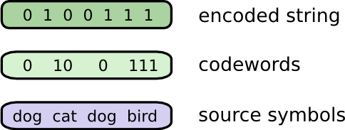

有一个细微的问题需要注意，在把单词编码后，如何在二进制串里将其切割变回单词呢？如果所有编码都一样长，那只需要编多长切多长即可。而变长情况下，我们需要保证每个编码都可被**唯一**的解码。

比如，0和01会产生混淆。 $0100111$ 可以被不唯一的解码。我们需要任一编码不是更长编码的前缀。

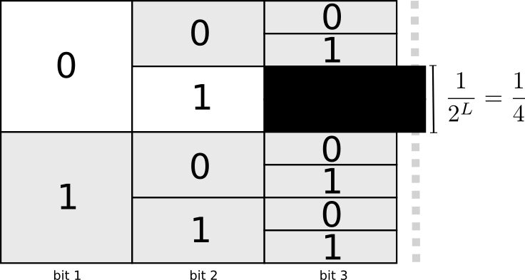

一种想法是，在编码时我们需要舍弃一些可能的编码空间。如果我们取0为编码方案，那么就要牺牲所有以0为前缀的编码空间。如果我们取01为编码，那么我们就失去了使用它的任何前缀的能力。由于有$1/4$的码字以01开头，这会为了一个2bits长的码字就牺牲了所有可能的1/4的码字。这也意味着所有其他的码字都要变得更长。

短码字需要牺牲更多的可能码空间。

### Optimal Encodings 最佳编码

你可以认为，你在受到基本约束的情况下尽量花光预算。我们取一个码字，就要牺牲另一部分可能的码字。

取一个长度为0的码字，所付出的代价是1，所有可能的码字。取一个长度为1的码字，比如'0'，是$1/2$。同理，取一个长度为2的码字，代价是$1/4$。

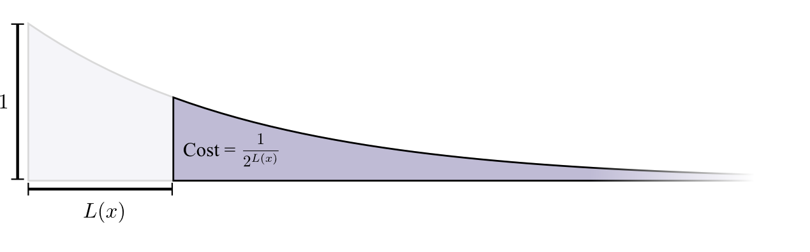

一般来说，编码的代价随着编码长度的增加呈指数递减。$Cost = \frac{1}{2^{L(x)}}$
其中，$\int_{x}^{+\infin} cost(x) dx = \frac{1}{ln2}\frac{1}{2^{L(x)}}$
图例中为了效果，近似取$e$为底，视右侧面积也为高度。

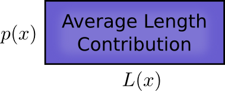

每个码字以其长度乘频率(可能性)的方式增加平均长度。一个4bits的码字有 $50\%$ 的出现频率，那么编码平均长度将会增加 $4*50\%=2$。

我们以长方形表示这个代价。码字的长度$L(x)$决定了会有增加多少长度。而码字的长度也决定了可能的码字代价。

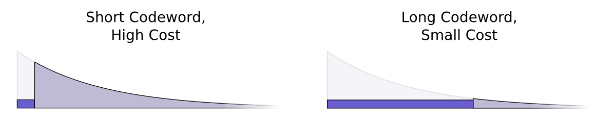

短的码字会减少平均长度，也意味着更多空间代价。长的码字付出的代价小，会更多的增加平均长度。

**我们希望尽可能减小码字，花更多的空间代价，最大程度削减平均长度。**

那么最佳策略是什么？

---

我们希望频率高的码字花费更多空间代价(更短)。有一个非常自然的方式：

如果一个事件以50%的概率发生，那就花费50%的的空间代价，给他一个足够短的码字。如果一个事件就发生1%，那就只牺牲1%的空间代价，

这听起来挺自然的，但是怎么证明这最佳呢？

---

先看只有两个事件的情况。如果事件 $a$ 的概率为 $p(a)$ ，事件 $b$发生概率为 $p(b)$。我们花费预算的 $p(a)$，让事件 $a$ 的码字更短。同理对 $b$ 如是处理。

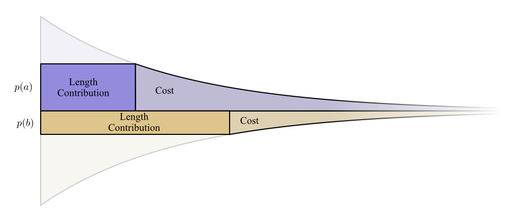

如图，此时花费的代价与花费的长度边界对齐。如果稍微改动长度，那么空间代价将会按边界高度比例减少，信息长度贡献将按照边界高度比例增加。

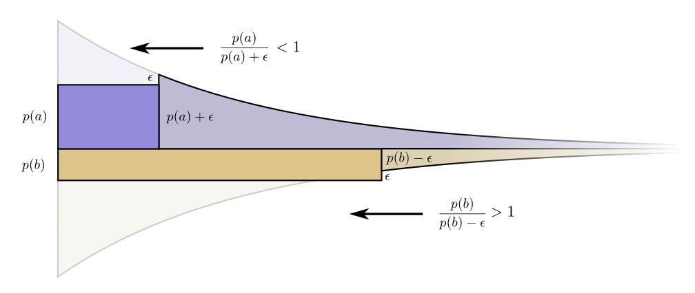

>更详细等证明见:
>https://colah.github.io/posts/2015-09-Visual-Information/

### Calculating Entropy

一个长度为$L$的信息代价是 $\frac{1}{2^L}$，则：

$$
Cost = \frac{1}{2^L}\\
L = log_2(\frac{1}{cost})
$$

我们的最佳策略是花费 $p(x)$，即：
$L(x) = log_2(\frac{1}{p(x)}) = -log_2p(x)$

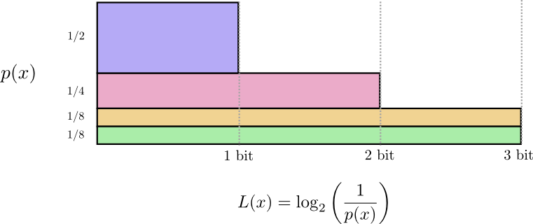

在一个特定的概率分布 $p$ 中传播事件的平均信息长度有一个基本限制，这个极限即使用最佳编码的平均信息长度，称为 $p$ 的**熵** $H(p)$。现在，我们知道了码字的最佳长度，我们可以实际计算了。

$$
H(p) = \sum_x p(x)L(x)\\
     = \sum_x p(x)log_2(\frac{1}{p(x)})
$$

更通常写成以下形式:
$$
     = -\sum_x p(x)log_2(p(x))
$$

如果你想传递一个事件的信息，那么你平均至少需要发送这些比特。

---

对于传递事件所需的平均信息数量，我们能很轻松的想到利用它进行信息压缩。但我们还有另一方面来考量：它描述了**不确定性**，并提供了**量化信息**的方法。

如果你知道一个事情必然要发生，那么你无需传递任何信息。如果两件事发生的概率是各50%，那么你只需要发送1bit。如果64个不同的事情等概率可能发生，你需要发送6bits。

概率越**集中**，就越能找到一个短的平均信息长度。概率越**分散**，就这一长度就会越长。

越是不确定，平均来看就越能学到信息，知道现在发生了什么。

## Cross-Entropy

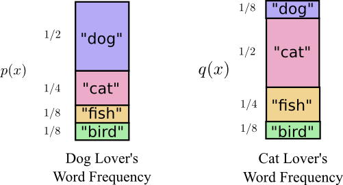

现在看看两个不一样的分布。
如果Alice沿用Bob的编码方案，那么她的平均编码长度将变成2.25(原1.75)。如果两个分布差距更大，这个数值还会再恶化。

用一个分布的最佳编码来计算另一个分布的平均编码长度，即**交叉熵**。

$$
H_p(q) = \sum_xq(x)log_2(\frac{1}{p(x)})
$$

Alice重新使用了自己的最佳编码后，得到的平均编码长度成功降低了。现在反过来，让Bob使用Alice的编码方案，出乎意外的是，Bob使用Alice的编码反而比Alice使用Bob的编码情况更糟。

4种可能性如下：

- Bob using his own: $H(p) = 1.75bits$
- Alice using Bob's: $H_p(q) = 2.25bits$
- Alice using her own: $H(q) = 1.75bits$
- Bob using Alice's: $H_q(p) = 2.375bits$

这不太符合直觉。
$$
H_p(q) \neq H_q(p)
$$

---

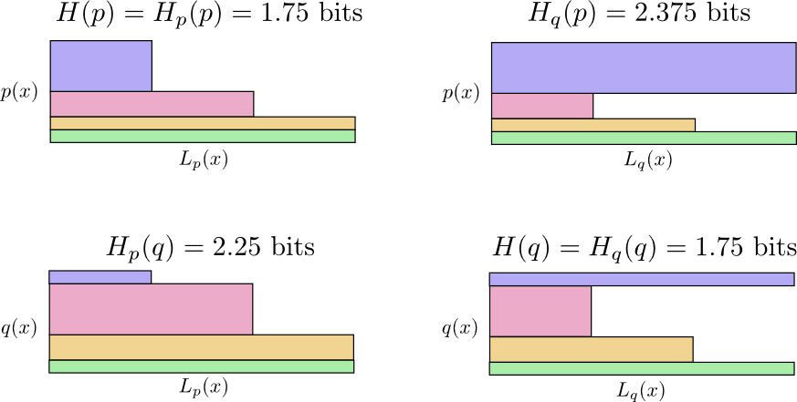

这4个图反映了4中情况下的概率分布和编码长度。
$H_q(p)$ 之所以比 $H_p(q)$ 大，是因为图中蓝色部分，即'dog'的部分在p分布中更常见，在q分布中最少见。

这说明交叉熵**不是对称的**。

---

交叉熵可以用来衡量两个分布的差距。两个分布的差距越大，那么交叉熵就会越大。

有趣之处在于交叉熵和信息熵的差值。如果这一差值为0，说明分布式相同。随着差值变大，分布的差异也变大。

这一差值叫做 *Kullback–Leibler divergence*，**KL散度**。p对q的KL散度如下定义:

$$
D_q(p) = H_q(p) - H(p)
$$

KL散度就好似是两个分布之间的差距。有时我们希望一个分布能离另一个分布更近，KL散度提供了一个自然的方法。

## Entropy and Multiple Variables

...
详见原文

## Conclusion

>If we care about communicating in a minimum number of bits, these ideas are clearly fundamental. If we care about compressing data, information theory addresses the core questions and gives us the fundamentally right abstractions. But what if we don’t care – are they anything other than curiosities?
Ideas from information theory turn up in lots of contexts: machine learning, quantum physics, genetics, thermodynamics, and even gambling. Practitioners in these fields typically don’t care about information theory because they want to compress information. They care because it has a compelling connection to their field. Quantum entanglement can be described with entropy.9 Many results in statistical mechanics and thermodynamics can be derived by assuming maximum entropy about the things you don’t know.10 A gambler’s wins or losses are directly connected to KL divergence, in particular iterated setups.11
**Information theory turns up in all these places because it offers concrete, principled formalizations for many things we need to express. It gives us ways of measuring and expressing uncertainty, how different two sets of beliefs are, and how much an answer to one question tells us about others: how diffuse probability is, the distance between probability distributions, and how dependent two variables are.** Are there alternative, similar ideas? Sure. But the ideas from information theory are clean, they have really nice properties, and a principled origin. In some cases, they’re precisely what you care about, and in other cases they’re a convenient proxy in a messy world.
Machine learning is what I know best, so let’s talk about that for a minute. A very common kind of task in machine learning is classification. Let’s say we want to look at a picture and predict whether it’s a picture of a dog or a cat. Our model might say something like “there’s a 80% chance this image is a dog, and a 20% chance it’s a cat.” Let’s say the correct answer is dog – how good or bad is it that we only said there was an 80% chance it was a dog? How much better would it have been to say 85%?
This is an important question because we need some notion of how good or bad our model is, in order to optimize it to do well. What should we optimize? The correct answer really depends on what we’re using the model for: Do we only care about whether the top guess was right, or do we care about how confident we are in the correct answer? How bad is it to be confidently wrong? There isn’t one right answer to this. And often it isn’t possible to know the right answer, because we don’t know how the model will be used in a precise enough way to formalize what we ultimately care about. The result is that there are situations where cross-entropy really is precisely what we care about, but that isn’t always the case. Much more often we don’t know exactly what we care about and cross-entropy is a really nice proxy.12
Information gives us a powerful new framework for thinking about the world. Sometimes it perfectly fits the problem at hand; other times it’s not an exact fit, but still extremely useful. This essay has only scratched the surface of information theory – there are major topics, like error-correcting codes, that we haven’t touched at all – but I hope I’ve shown that information theory is a beautiful subject that doesn’t need to be intimidating.