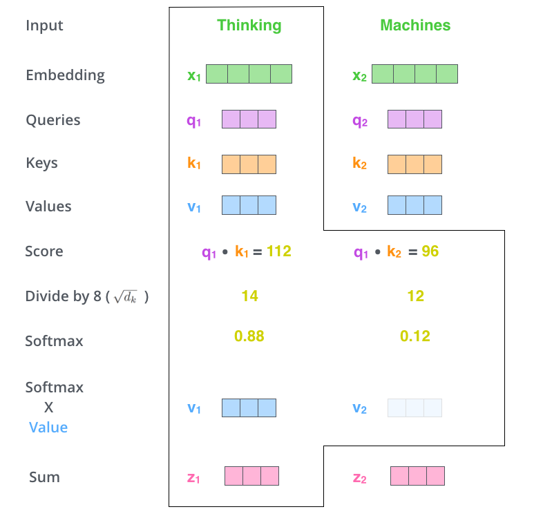

# Attention is All You Need

## Abstract

The ==dominant== sequence transduction models are based on complex ==recurrent or convolutional== neural networks that include an **encoder and a decoder**. The best performing models also connect the encoder and decoder through an attention mechanism. We ==propose== a new simple network architecture, the **Transformer**, based solely on attention mechanisms, ==dispensing== with recurrence and convolutions entirely. 

>当前主流的序列转换模型通常基于复杂的循环神经网络（RNN）或卷积神经网络（CNN），并通过注意力机制连接编码器和解码器。本文提出了一种全新的、简洁的网络架构——Transformer，它完全基于注意力机制，彻底摒弃了循环和卷积结构。
>- dominant: 主流的
>- transduct: trans转换 +duct引导
>- recurrent nerual network,RNN,循环神经网络
>- convolutional nerual network,CNN,卷积神经网络
>- propose 提出
>- dispense 免除,摒弃(分发)

Experiments on two machine translation tasks show these models to be superior in quality while being more ==parallelizable== and requiring significantly less time to train. Our model achieves 28.4 BLEU on the WMT 2014 English-to-German translation task, improving over the existing best results, including ensembles, by over 2 BLEU. On the WMT 2014 English-to-French translation task, our model establishes a new single-model ==state-of-the-art== BLEU score of 41.8 after training for 3.5 days on eight GPUs, a small fraction of the training costs of the best models from the literature.

>在两个机器翻译任务上的实验表明，Transformer在质量上优于现有模型，同时具备更强的并行能力，训练时间显著减少。在WMT 2014英德翻译任务中，Transformer取得了28.4的BLEU分数，比现有最佳模型（包括集成模型）高出超过2分。在英法翻译任务中，单一模型达到了41.8的BLEU分数，仅用8块GPU训练3.5天，远低于文献中其他模型的训练成本。
>- state-of-art 当前最好的

We show that the Transformer ==generalizes== well to other tasks by applying it successfully to English ==constituency -parsing== both with large and limited training data.

>*此外，Transformer在英语句法分析任务中也表现出良好的泛化能力，无论是在大规模还是有限数据集上都取得了成功。*
>- generalize 泛化
>- constituency-parsing 成分分析

## 1.Introduction

Recurrent neural networks, long short-term memory [13] and gated recurrent [7] neural networks in particular, have been firmly established as state of the art approaches in sequence modeling and transduction problems such as language modeling and machine translation [35, 2, 5]. Numerous efforts have since continued to push the boundaries of recurrent language models and encoder-decoder architectures [38, 24, 15].

>循环神经网络（RNN）、长短期记忆网络（LSTM）和门控循环单元（GRU）已被广泛确立为序列建模和转换任务（如语言建模和机器翻译）的主流方法。大量研究持续推动循环语言模型和编码器-解码器架构的边界。

Recurrent models typically factor computation along the symbol positions of the input and output sequences. Aligning the positions to steps in computation time, they generate a sequence of hidden states $h_t$, as a function of the previous hidden state $h_{t−1}$ and the input for position $t$.

>循环模型通常将计算过程按输入和输出序列中的符号位置进行因式分解。它们将这些位置与计算时间步骤对齐，生成一系列隐藏状态 $h_t$，该状态是前一隐藏状态 $h_{t-1}$ 和当前位置输入的函数$t$

This ==inherently== sequential nature ==precludes== parallelization within training examples, which becomes critical at longer sequence lengths, as memory constraints limit *(verb)* batching across examples. Recent work has achieved significant improvements in computational efficiency through factorization tricks [21] and conditional computation [32], while also improving model performance in case of the latter. The fundamental constraint of sequential computation, however, remains.

>这种固有的顺序特性使得在训练样本内部无法并行化，尤其在处理较长序列时，由于内存限制，跨样本的批处理变得尤为困难。尽管近期研究通过因式分解技巧和条件计算显著提升了计算效率，并在某些情况下提高了模型性能，但顺序计算的基本限制仍然存在。

>Attention mechanisms have become an integral part of ==compelling== sequence modeling and transduction models in various tasks, allowing modeling of dependencies without regard to their distance in the input or output sequences [2, 19]. In all but a few cases [27], however, such attention mechanisms are used in ==conjunction== with a recurrent network.
>注意力机制已成为许多序列建模和转换任务中不可或缺的组成部分，它允许在输入或输出序列中建模远距离的依赖关系，而不受位置距离的限制。然而，除了少数例外，这些注意力机制通常仍与循环网络结合使用。
>- compel 强迫,驱使
>- compelling 引人注目的
>- conjunction 结合,联合

In this work we propose the Transformer, a model architecture ==eschewing== recurrence and instead relying entirely on an attention mechanism to draw global dependencies between input and output. The Transformer allows for significantly more parallelization and can reach a new state of the art in translation quality after being trained for as little as twelve hours on eight P100 GPUs.

>在本研究中，我们提出了一种名为 Transformer 的新型模型架构，它完全摒弃了循环结构，完全依赖注意力机制来捕捉输入与输出之间的全局依赖关系。Transformer 架构显著提升了并行处理能力，并且在仅使用 8 块 P100 GPU 训练 12 小时后，就在翻译质量上达到了新的水平。
>- eschew 避免,拒绝 (别嚼)

## 2.Background

The goal of reducing sequential computation also forms the foundation of the Extended Neural GPU [16], ByteNet [18] and ConvS2S [9], all of which use convolutional neural networks as basic building block, computing hidden representations in parallel for all input and output positions. In these models, the number of operations required to relate signals from two arbitrary input or output positions grows in the distance between positions, linearly for ConvS2S and logarithmically for ByteNet. This makes it more difficult to learn dependencies between distant positions [12]. In the Transformer this is reduced to a constant number of operations, ==albeit== at the cost of reduced effective resolution due to averaging attention-weighted positions, an effect we ==counteract== with Multi-Head Attention as described in section 3.2.

>减少序列计算的目标也构成了 Extended Neural GPU、ByteNet 和 ConvS2S 等模型的基础。这些模型使用卷积神经网络作为基本构建块，能够在所有输入和输出位置上并行计算隐藏表示。在这些模型中，关联任意两个输入或输出位置所需的操作数量会随着位置之间的距离而增长：ConvS2S 是线性增长，ByteNet 是对数增长。这使得学习远距离位置之间的依赖关系变得更加困难。在 Transformer 中，这种操作数量被减少为常数，尽管代价是由于对注意力加权位置的平均处理而导致的有效分辨率下降。我们通过第 3.2 节中描述的多头注意力机制来抵消这一影响。
>- albeit 尽管
>- counteract 对抗,中和

Self-attention, sometimes called intra-attention is an attention mechanism relating different positions of a single sequence in order to compute a representation of the sequence. Self-attention has been used successfully in a variety of tasks including reading comprehension, abstractive summarization, textual ==entailment== and learning task-independent sentence representations [4, 27, 28, 22].

>自注意力机制（有时称为“内部注意力”）是一种将同一序列中不同位置关联起来的注意力机制，用于计算该序列的表示。自注意力已在多种任务中成功应用，包括阅读理解、抽象摘要生成、文本蕴含判断以及学习任务无关的句子表示。
>- entail 牵扯
>- entailment 蕴含

End-to-end memory networks are based on a recurrent attention mechanism instead of sequence-aligned recurrence and have been shown to perform well on simple-language question answering and language modeling tasks [34].
>端到端记忆网络基于循环注意力机制而非序列对齐的循环结构，已在简单语言问答和语言建模任务中表现良好。

To the best of our knowledge, however, the Transformer is the first transduction model relying entirely on self-attention to compute representations of its input and output without using sequence-aligned RNNs or convolution. In the following sections, we will describe the Transformer, motivate self-attention and discuss its advantages over models such as [17, 18] and [9].
>据我们所知，Transformer 是第一个完全依赖自注意力机制来计算输入和输出表示的转换模型，它不使用序列对齐的 RNN 或卷积结构。在接下来的章节中，我们将详细介绍 Transformer 架构，阐述自注意力机制的动机，并讨论它相较于其他模型（如 Extended Neural GPU、ByteNet 和 ConvS2S）的优势。

## 3.Model Architecture

Most competitive neural sequence transduction models have an encoder-decoder structure. Here, the encoder maps an input sequence of symbol representations $ (x_1, \dots, x_n) $ to a sequence of continuous representations $ \mathbf{z} = (z_1, \dots, z_n) $. Given $ \mathbf{z} $, the decoder then generates an output sequence $ (y_1, \dots, y_m) $ of symbols one element at a time. At each step the model is auto-regressive [10], consuming the previously generated symbols as additional input when generating the next.

>大多数具有竞争力的神经序列转换模型采用编码器-解码器结构。在这种结构中，编码器将输入的符号表示序列 $ (x_1, \dots, x_n) $ 映射为连续表示序列 $ \mathbf{z} = (z_1, \dots, z_n) $。在获得 $ \mathbf{z} $ 之后，解码器逐步生成输出符号序列 $ (y_1, \dots, y_m) $，每次生成一个元素。每一步模型都是自回归的，在生成下一符号时消耗之前生成的符号作为额外的输入。

---

> 图中 shifted right 表示的是目标序列的"移位"
> 在模型的训练过程中，在序列前加入 \<BOS> begin of sentense
> 比如Bonjour → Hello 的翻译过程中，我们将插入一个\<BOS>
> 输入将是: \<BOS> Hello 并期望得到输出: Hello \<EOS>
> 在实际的推理中，输入只有 \<BOS> 因为我们要一点一点生成
> 并在一次推理后得到 \<BOS> H 这将作为下一次输入，最后不停拼出 Hello \<EOS>

### 3.1 Encoder and Decoder Stacks

Encoder: 
The encoder is composed of a stack of $N = 6$ identical layers. Each layer has two sub-layers. The first is a multi-head self-attention mechanism, and the second is a simple, ==position-wise== fully connected feed-forward network. We employ a ==residual connection== around each of the two sub-layers, followed by layer normalization. That is, the output of each sub-layer is $ \text{LayerNorm}(x + \text{Sublayer}(x)) $, where $ \text{Sublayer}(x) $ is the function implemented by the sub-layer itself. To facilitate these residual connections, all sub-layers in the model, as well as the embedding layers, produce outputs of dimension $d_{\text{model}} = 512$.

Decoder: 
The decoder is also composed of a stack of $N = 6$ identical layers. In addition to the two sub-layers in each encoder layer, the decoder inserts a third sub-layer, which performs multi-head attention over the output of the encoder stack. Similar to the encoder, we employ residual connections around each of the sub-layers, followed by layer normalization. We also modify the self-attention sub-layer in the decoder stack to prevent positions from attending to subsequent positions. This masking, combined with the fact that the output embeddings are offset by one position, ensures that the predictions for position $i$ can depend only on the known outputs at positions less than $i$.

>编码器： 编码器由一个堆叠的 $N = 6$ 个相同层组成。每一层包含两个子层：第一是多头自注意力机制，第二是一个简单的逐位置全连接前馈网络。我们在每个子层外部使用残差连接，并在其后进行层归一化。也就是说，每个子层的输出为 $ \text{LayerNorm}(x + \text{Sublayer}(x)) $，其中 $ \text{Sublayer}(x) $ 是该子层实现的函数。为了实现这些残差连接，模型中的所有子层以及嵌入层都输出维度为 $d_{\text{model}} = 512$ 的向量。
>解码器： 解码器同样由一个堆叠的 $N = 6$ 个相同层组成。除了每个编码器层中的两个子层外，解码器还插入了第三个子层，用于对编码器堆栈的输出执行多头注意力机制。与编码器类似，我们在每个子层外部使用残差连接，并在其后进行层归一化。我们还对解码器堆栈中的自注意力子层进行了修改，以防止当前位置关注后续位置。这种掩蔽机制结合输出嵌入向量的偏移，确保位置 $i$ 的预测只能依赖于位置小于 $i$ 的已知输出。
> - position-wise 按位置逐元素
> - residual connection 残差连接

### 3.2 Attention

An attention function can be described as mapping a query and a set of key-value pairs to an output, where the query, keys, values, and output are all vectors. The output is computed as a weighted sum of the values, where the weight assigned to each value is computed by a ==compatibility== function of the query with the corresponding key.

> 注意力函数可以被描述为：将一个查询向量（query）与一组键值对（key-value pairs）映射为一个输出向量，其中查询、键、值和输出都是向量。输出是对所有值的加权求和，其中每个值的权重由查询与对应键之间的兼容性函数计算得出。
> - compatibility 兼容性

#### 3.2.1 Scaled Dot-Product Attention

We call our particular attention “Scaled Dot-Product Attention” (Figure 2). The input consists of queries and keys of dimension $d_k$, and values of dimension $d_v$. We compute the dot products of the query with all keys, divide each by $\sqrt{d_k}$, and apply a softmax function to obtain the weights on the values. In practice, we compute the attention function on a set of queries ==simultaneously==, packed together into a matrix $Q$. The keys and values are also packed together into matrices $K$ and $V$. We compute the matrix of outputs as:
$$
\text{Attention}(Q, K, V) = \text{softmax}\left( \frac{QK^\top}{\sqrt{d_k}} \right) V
$$

>我们称这种注意力机制为“缩放点积注意力”（见图 2）。输入由维度为 $d_k$ 的查询（query）和键（key），以及维度为 $d_v$ 的值（value）组成。我们首先计算查询与所有键的点积，然后除以 $\sqrt{d_k}$，再通过 softmax 函数得到每个值的权重。在实际操作中，我们将一组查询打包成一个矩阵 $Q$，键和值也分别打包成矩阵 $K$ 和 $V$。最终输出矩阵的计算公式为：...

The two most commonly used attention functions are additive attention and dot-product (multiplicative) attention. Dot-product attention is ==identical== to our algorithm, except for the scaling factor of $\frac{1}{\sqrt{d_k}}$. Additive attention computes the compatibility function using a feed-forward network with a single hidden layer.

While the two are similar in theoretical complexity, dot-product attention is much faster and more space-efficient in practice, since it can be implemented using highly optimized matrix multiplication code. While for small values of $d_k$ the two mechanisms perform similarly, additive attention outperforms dot-product attention without scaling for larger values of $d_k$. We suspect that for large values of $d_k$, the dot products grow large in magnitude, pushing the softmax function into regions where it has extremely small gradients. To counteract this effect, we scale the dot products by $\frac{1}{\sqrt{d_k}}$.

>目前最常用的注意力函数有两种：加性注意力（additive attention）和点积注意力（dot-product attention）。点积注意力与我们的方法几乎一致，唯一的区别是我们加入了缩放因子 $1/\sqrt{d_k}$。加性注意力使用一个带有单隐藏层的前馈网络来计算兼容性函数。
>尽管两者在理论复杂度上相似，但在实际应用中，点积注意力更快且更节省空间，因为它可以通过高度优化的矩阵乘法代码实现。对于较小的 $d_k$ 值，两种机制表现相近；但在较大的 $d_k$ 情况下，如果不进行缩放，加性注意力的表现优于点积注意力。我们推测这是因为较大的 $d_k$ 会导致点积结果数值过大，从而使 softmax 函数进入梯度极小的区域。为了解决这个问题，我们对点积结果进行缩放，乘以 $1/\sqrt{d_k}$。
> - simultaneous 同时
> - identical 一样的

---

> 这里描述的注意力机制是通用的，而不是该架构里的具体实现。在endoder和decoder中几个注意力层略有差别。
> Q，K，V矩阵都是由输入的嵌入向量和一个权重矩阵相乘得到的。这些权重矩阵初始随机，需要经过训练。
> 每次向量进入注意力模块，都要计算新的Q，K，V。不同的注意力头都有自己的权重矩阵，用来计算自己的Q，K，V。
> 我们期望Q，Query能够包含当前token的需求。
> 我们期望K，Key包含当前token的信息。
> 我们期望V，Value包含能够提供的有用信息。
> 对于一个query向量而言，通过点积我们计算出它与其他token的相似度。
> 经过softmax对它们归一化后，使用V进行加权求和。结果直接累加在原向量上。
> 即 $ \vec{x}_{update}= \vec{x}+Attention(\vec{x}W^{Q},\vec{x}W^{K},\vec{x}W^{V})$ (此处视 $\vec{x}$ 为行向量)
> 一个向量被注意力模块处理，即经过了上下文信息的更新。一组待处理的输入向量用矩阵$X$形式表示。

---

> 权重矩阵本身也是由整体训练得来的。因为 $\text{Attention}(Q, K, V) = \text{softmax}\left( \frac{QK^\top}{\sqrt{d_k}} \right) V$ 这个表达式本身也是关于 $W^Q$,$W^K$, $W^V$的函数。关于矩阵求导的数学知识在此不做展开。
> 这也侧面说明了，不管多么复杂的损失函数，我们必然能通过梯度修改某一参数降低损失。

### 3.2.2 Multi-Head Attention

 

Instead of performing a single attention function with $d_{\text{model}}$-dimensional keys, values and queries, we found it beneficial to linearly project the queries, keys and values $h$ times with different, learned linear projections to $d_k$, $d_k$ and $d_v$ dimensions, ==respectively==. On each of these projected versions of queries, keys and values we then perform the attention function in parallel, yielding $d_v$-dimensional output values. These are concatenated and once again projected, resulting in the final values, as depicted in Figure 2.

Multi-head attention allows the model to jointly attend to information from different representation subspaces at different positions. With a single attention head, averaging ==inhibits== this.

$$
\text{MultiHead}(Q, K, V) = \text{Concat}(\text{head}_1, \dots, \text{head}_h) W^O
$$

$$ 
\text{head}_i = \text{Attention}(Q W_i^Q, K W_i^K, V W_i^V)
$$

>与其在 $d_{\text{model}}$ 维的键（keys）、值（values）和查询（queries）上执行单一的注意力函数，我们发现将查询、键和值分别通过不同的线性投影 $h$ 次，投影到 $d_k$、$d_k$ 和 $d_v$ 维度会更有益处。然后，在这些投影后的查询、键和值的版本上，我们并行地执行注意力函数，得到 $d_v$ 维的输出向量。这些向量会被拼接（concatenate）在一起，并再次投影，得到最终的输出值，如图 2 所示。
>多头注意力机制允许模型在不同的位置上，同时关注来自不同表示子空间的信息。如果只使用一个注意力头，信息会被平均处理，从而削弱这种能力。
> - respective 分别，各自
> - re+spect 表示多看两眼，引申尊重，继而引申分别对待。
> - inhibit 抑制，阻止

The projections are parameter matrices $W_i^Q \in \mathbb{R}^{d_{\text{model}} \times d_k}$, $W_i^K \in \mathbb{R}^{d_{\text{model}} \times d_k}$, $W_i^V \in \mathbb{R}^{d_{\text{model}} \times d_v}$ and $W^O \in \mathbb{R}^{h \cdot d_v \times d_{\text{model}}}$.

In this work we employ $h = 8$ parallel attention layers, or heads. For each of these we use $d_k = d_v = d_{\text{model}} / h = 64$. Due to the reduced dimension of each head, the total computational cost is similar to that of single-head attention with full dimensionality.
>投影矩阵为参数矩阵：...
>在本研究中，我们采用 $h = 8$ 个并行的注意力层（即注意力头）。对于每个注意力头，我们使用 $d_k = d_v = d_{\text{model}} / h = 64$。由于每个头的维度减少，总计算成本与在完整维度下的单头注意力相似。

---

> 这一小节给出的公式出现了混淆。 $\text{head}_i = \text{Attention}(Q W_i^Q, K W_i^K, V W_i^V)$ 中出现的 $Q,K,V$ 实则是 $E$ 。
> 我们将 $EW^Q,EW^K,EW^V$ 中的**系数矩阵**稍作裁剪，使其投影到更小的维度。
> 这样多个独立的权重矩阵组成多个注意力头，每个注意力头的权重矩阵都独立训练，在结果进行拼接后，再将其投影回到 $d_{model}$ 维。
> 每个头维度的减小，是为了让计算性能均分在多个注意力头后仍和完整维度下的单头注意力保持一致。

>对于单头注意力，以行向量 $\vec{x}$ 为例
$$
q = \vec{x} W^Q_{model \times model}
$$
>对于多头注意力，我们将一个大的单头分割为 $h$ 个小头。
$$
q = \vec{x} W^Q_{model \times \frac{model}{h}}
$$
FFL只期望一个注意力头，因此我们需要将多个分割的注意力头粘合在一起后，通过投影矩阵 $W^O$ 将其变换回前馈网络需要的大小。

### 3.2.3 Applications of Attention in our Model

The Transformer uses multi-head attention in three different ways:

- In "**encoder-decoder attention**" layers, **the queries come from the previous decoder layer, and the memory keys and values come from the output of the encoder.** This allows every position in the decoder to attend over all positions in the input sequence. This mimics the typical encoder-decoder attention mechanisms in sequence-to-sequence models such as [38, 2, 9].
- The encoder contains self-attention layers. In a self-attention layer all of the keys, values and queries come from the same place, in this case, the output of the previous layer in the encoder. Each position in the encoder can attend to all positions in the previous layer of the encoder.
- Similarly, self-attention layers in the decoder allow each position in the decoder to attend to all positions in the decoder up to and including that position. We need to prevent leftward information flow in the decoder to preserve the auto-regressive property. We implement this inside of scaled dot-product attention by masking out (setting to $−∞$) all values in the input of the softmax which correspond to illegal connections. See Figure 2.

>Transformer 在三种不同的方式中使用了多头注意力机制：
>- 编码器-解码器注意力（encoder-decoder attention）层 在这些层中，查询（queries）来自解码器前一层的输出，而记忆键（keys）和值（values）来自编码器的输出。 这使得解码器中的每个位置都可以关注输入序列的所有位置。 这种方式模拟了序列到序列（sequence-to-sequence）模型中典型的编码器-解码器注意力机制，例如 [38]、[2]、[9] 中的做法。
>- 编码器中的自注意力（self-attention）层 在自注意力层中，键、值和查询全部来自同一来源——这里是编码器前一层的输出。 编码器中的每个位置都可以关注编码器前一层中的所有位置。
>- 解码器中的自注意力层 同样地，解码器中的自注意力层允许解码器的每个位置关注解码器中到该位置为止的所有位置（包括当前位置）。 为了保持自回归（auto-regressive）特性，需要阻止信息向左传播（即从当前位置访问未来位置）。 我们在缩放点积注意力（scaled dot-product attention）内部，通过对 softmax 输入中所有对应于非法连接的值进行屏蔽（masking）（将其设为 −∞）来实现这一点。 参见图 2。

---

> 这篇论文提出的是Transformer的原始版本，不同于后世的GPT和BERT，它同时使用encoder与decoder。
> 在注意力机制上，本篇文章使用放缩点积注意力，即通过点积计算相似度，通过除以一个系数进行放缩。但在不同位置上注意力机制略有区别。
> 
> - **encoder的自注意力层中**，Q，K，V来自同一来源：前一encoder的输出。在encoder中没有使用掩码，允许向量自由前后交流。
> - **decoder的自注意力层**中，与GPT一样使用自回归，Q，K，V均来源于前一层decoder的输出。同时使用掩码。
> - **decoder的encoder-decoder注意力层**则是encoder和decoder的结合部，只有Q来自decoder，而K与V均来自于encoder。这相当于在encoder的基础上做query，而不仅仅来源于前文。同理没有掩码。

## 3.3 Position-wise Feed-Forward Networks

In addition to attention sub-layers, each of the layers in our encoder and decoder contains a fully connected feed-forward network, which is applied to each position separately and identically. This consists of two linear transformations with a ReLU activation in between.

$$
FFN(x) = max(0,xW_1+b_1)W_2+b_2
$$

While the linear transformations are the same across different positions, they use different parameters from layer to layer. Another way of describing this is as two convolutions with kernel size 1. The dimensionality of input and output is $d_{model}=512$, and the inner-layer has dimensionality $d_{ff}=2048$

## 3.4 Embeddings and Softmax

Similarly to other sequence transduction models, we use learned embeddings to convert the input tokens and output tokens to vectors of dimension $d_{model}$
. We also use the usual learned linear transformation and softmax function to convert the decoder output to predicted next-token probabilities. In our model, we share the same weight matrix between the two embedding layers and the pre-softmax linear transformation, similar to [30]. In the embedding layers, we multiply those weights by $d_{model}$

## 3.5 Positional Encoding

Since our model contains no recurrence and no convolution, in order for the model to make use of the order of the sequence, we must inject some information about the relative or absolute position of the tokens in the sequence. To this end, we add "positional encodings" to the input embeddings at the bottoms of the encoder and decoder stacks. The positional encodings have the same dimension $ d_{\text{model}} $ as the embeddings, so that the two can be summed.

There are many choices of positional encodings, learned and fixed [9]. In this work, we use sine and cosine functions of different frequencies:

$$
PE(pos, 2i) = \sin\left(\frac{pos}{10000^{\frac{2i}{d_{\text{model}}}}}\right)
$$

$$
PE(pos, 2i+1) = \cos\left(\frac{pos}{10000^{\frac{2i}{d_{\text{model}}}}}\right)
$$

where $ pos $ is the position and $ i $ is the dimension. That is, each dimension of the positional encoding corresponds to a sinusoid. The wavelengths form a geometric progression from $ 2\pi $ to $ 10000 \cdot 2\pi $.

We chose this function because we hypothesized it would allow the model to easily learn to attend by relative positions, since for any fixed offset $ k $, $ PE_{pos+k} $ can be represented as a linear function of $ PE_{pos} $.

We also experimented with using learned positional embeddings [9] instead, and found that the two versions produced nearly identical results (see Table 3 row (E)). We chose the sinusoidal version because it may allow the model to extrapolate to sequence lengths longer than the ones encountered during training.

## myVisualized View

>This softmax score determines **how much each word will be expressed** at this position. Clearly the word at this position will have the highest softmax score, but sometimes it’s useful to attend to another word that is relevant to the current word.

$ q_1·k_2$ 计算出 $x_1$ 在 $x_2$ 位置的 'score'，用softmax进行标准化。

>The fifth step is to multiply each value vector by the softmax score (in preparation to sum them up). The intuition here is to keep intact the values of the word(s) we want to focus on, and *drown-out* irrelevant words (by multiplying them by tiny numbers like 0.001, for example).

softmax_score与 $V$ 相乘体现为尽量保持有关词的联系，排空无关词的干扰。

---

在列向量视角下, $M \vec{x} = \vec{b}$ 视为对列向量 $\vec{x}$ 的变换。即空间变换体现在左乘。
在行向量视角下, $\vec{x} M = \vec{b}$ 视为对行向量 $\vec{x}$ 的变换。即空间变换体现在右乘。

## myReferences

- illustrated Transformer
  https://jalammar.github.io/illustrated-transformer/

