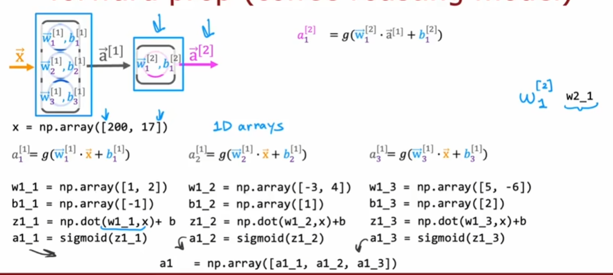
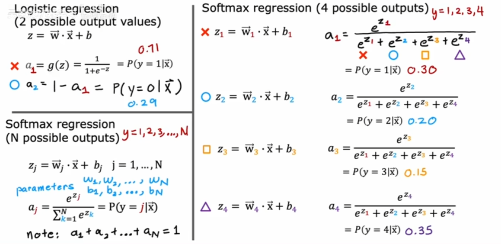

# 深度学习

## 总览

神经网络(Neural Networks)最初是为了模拟大脑工作所提出的，在上世纪八九十年代兴起，又在九十年代衰落，直到2005年才重新兴起。尽管一开始是为了模拟大脑这一生物目的被提出，但今天的神经网络与网络如何工作几乎无关。我们对大脑的生物学认识太过浅显，盲目地用如今对大脑的不充分认识来模拟大脑不见得会有成果。但我们从生物学灵感上得到了一个简化的数学模型：神经元(neuron)，接受输入并给出输出，输出又作为另一个神经元的输入。

因为历史关系的变化，现在我们一般叫它**深度学习**(deep learning)。为什么现在它又兴起了呢？

在数据量急剧增长的现代，传统的机器学习方案不能有效的利用这些庞大的数据（比如线性回归，逻辑回归）。但研究者们发现如果在同样的数据集下建立一个小神经网络，其性能表现往往要强于传统方案。对于一些特定类型的应用程序（数据庞大），建立更庞大的神经网络，其性能表现更好。

如果你能训练一个非常大的神经网络，利用你拥有的大量数据，你将可以在从语音识别到图像识别的任何事情上获得性能，而这是早期的机器学习算法做不到的。

## 多层感知机 Multi-payer Perceptron

假设你是一个淘宝卖家，你归纳了一件衣服的各种数据，并试图判断它是否会畅销。
这是一个二分问题，即答案只有是与否，我们可以用logistic回归来解决。比如，输入x为衣服价格，输出 $f(x)= \frac{1}{1+e^{-(wx+b)}}$ 。

为了建立一个神经网络，我们要稍微改变一下术语。我们使用小写字母a，activation，表示这个logistic回归的输出。这是神经科学领域的一个术语“**激活**”，表示一个神经元发送了多少对下游其他神经元的输出。

这个逻辑回归的小单元可以被认为是神经元的一个非常简化的模型：它接受输入x，并给出输出$a = f(x)= \frac{1}{1+e^{-(wx+b)}}$ ，它输出这件衣服畅销的概率。要建立一个神经网络，你只需要弄一大堆这样的神经元，并把他们连在一起。

而如果问题更复杂呢？假如你拥有不止价格，还拥有运费，营销费，衣服材质等参数呢？你可能会想，一件衣服的畅销程度可能与用户的购买力、用户感知、用户对质量的要求等有关。

我们可以制造一个专门用于评估用户购买力的神经元。它接受：衣服价格、运费参数，并给出一个输出。建立用户感知神经元，接受营销费用作为参数，也给出一个输出。种种方面都可以用这样的神经元来表示：他们接受若干输入，并给出一个输出。

最后我们只需要把这一大堆神经元的输出作为最后一个神经元的输入：我们期望他能给出该衣服畅销的概率。这就是一个神经网络模型。

在最开始的输入，与最终输出的概率之间，我们建立了若干神经元来评估购买力、用户感知、质量需求等。这一列，或者说一组神经元称为一**层**，layer。一层可能有多个或者单一神经元。

---

我们称给入特征x的一层神经元叫**输入层**(input layer)，最终输出结果的层级叫**输出层**(output layer)。夹在输入和输出中间的神经元层级，即**隐藏层**(hidden layer)。我们对向后的输入叫**激活**(activation)，而对他们的输入即**激活值**(activation values)。

要建立一个大的神经网络，你可能要手动决定哪些神经元应该接受哪些特征作为输入。在实际中，层与层之间是全连接的，你只需要适当的设置参数来让“判断购买力”的神经元重视价格输入，忽视营销费用，让神经元关注自己的功能。

我们可以再对这个模型做一次简化：输入层输入一组特征，即一个向量。中间层接受激活值，并给出激活向后传递。最终，我们得到输出，即：$\vec{x} \rightarrow \vec{a} \rightarrow a$

中间层之所以叫做隐藏层，是因为你用训练集做训练的时候，你的数据可以告诉你开头的**输入**与**输出**的结果，而你看不到中间层内部的输入和输出。

---

在机器学习部分，我们提到过特征方程工程。当时的例子是，使用房子的长度、宽度、深度，占地面积等等特征构建f，我们手动人工打造特征方程，充满了工匠精神。

而深度学习的好处就在于，你不需要手动设计这种特征方程。在上例中我们让隐藏层计算了：购买力，感知度，质量需求。而实际上，神经网络一个很好的特性是，当你用训练集训练它的时候，你根本不需要手动设计这些功能，整个神经网络会自行弄清它在隐藏层中需要什么。

隐藏层可以有很多层，在你设计自己的神经网络时，你需要做的一个决定就是你到底要多少个隐藏层，以及每个隐藏层里要多少个神经元，即选择一个足够好的**神经网络结构**(neural network architecture)，这将对算法的性能产生影响。

这种多层神经网络即**多层感知器**(multilayer perceptron)

>一个图像识别的例子：
>假如你弄了个多层神经网络来识别图像，有若干个隐藏层。
>当你看向某一层中的某个神经元，你可能会发现这个神经元专注于寻找竖线，另一个神经元专注于寻找横线。不同的神经元寻找不同方向的线条。
>当你看向下一层中的神经元，你发现他们试图学会把短线条组合起来，来寻找鼻子，眼睛。
>再看向下一层，可能他们开始学习将人脸的不同部分组合起来，检测人脸与不同脸型的对应程度，帮助输出层输出。
>神经网络能从数据中找出这些东西。

### 更复杂的情景

一个神经网络可以拥有很多层，通常输入层视为第0层，隐藏层的第一层视为第1层，并向后传递。

我们使用方括号上标，来标识第几层的值，比如 $\vec{a}^{[4]}$ ，表示第4层向后传递的激活向量。

每一层内有若干神经元，神经元接受输入，并给出输出a。一层神经元将给出一堆输出，这些输出作为一个**向量** $\vec{a}$向后传递，并成为下一层的输入。

$a_1^{[3]} = g(\vec{w_1}^{[3]} · \vec{a}^{[2]} + b_1^{[3]})$  表示第三层的第一个神经元，正在使用自己的参数w与b，结合上一层传递的输入 $a^{[2]}$ ，计算自己的激活值 $a_3^{[3]}$。
更一般地，第i层中第j个神经元接受上一层的输出 $a^{[i-1]}$ 作为本层的输入，并计算自己的输出 $a_j^{[i]} = g(\vec{w_j}^{[i]} · \vec{a}^{[i-1]} + b_j^{[i]})$

此处g还有一个名字，叫做**激活函数**(activation function)，因为它输出激活值a。在上文判断衣服畅销的二分例子中，这个激活函数可以是sigmoid函数。在其他情况里也会使用不同的激活函数。

## Tensorflow示例

### 前向传播 Forward Propagation

从前到后，从左到右，从0层到最后一层输出，即**前向传播**(forward propagation)。
与之相对的是**反向传播**(backward propagation)。

我们以tensorflow为例，列举你需要用到的代码。

```
# 创建层
layer_1 = Dense(units=3,activation = "sigmoid")
layer_2 = Dense(units=3,activation = "sigmoid")

# 串联层
model = Sequential([layer_1,layer_2])

# 给数据 训练集输入特征
x = np.array([200.0,17,0],
             [120.0,5.0],
             [425.0,20,0],
             [212.0,18.0])

# 目标,yes与no
y = np.array([1,0,0,1])

model.compile(...)
model.fit(x,y)

model.predict(x_new)

```


你可以使用tensorflow库，用几个函数就轻松的完成前向传播。但下图说明了其代码上的具体原理。



对于给定的特征输入x，layer1中的三个神经元分别根据自己的参数与其得到的输入x进行运算，并输入sigmoid函数。最终我们得到3个 $a^{[1]}_i$ ，他们一同构成本层的输出，并作为下一层的输入，即 $\vec{a}^{[1]} = [a^{[1]}_1,a^{[1]}_2,a^{[1]}_3]$。

更一般地，一个dense层(tensorflow中的layer)中的向后传播可以如下表示：

```
def dense(a_in,W,b,g):
    units = W.shape[1] #取参数矩阵的列 即几个神经元
    a_out = np.zeros(units) #初始化输出激活值
    for j in range(units):
        #第一个:表示所有行, 第二个表示j列 即取出W矩阵第j列
        w = W[:,j]
        z = np.dot(w,a_in) + b[j]
        a_out[j] = g(z)
    return a_out
```

那么tensorflow函数sequential用来串联几个层。他可以如下表示：

```
def sequential(x):
    a1 = dense(x,W1,b1)
    a2 = dense(a1,W2,b2)
    a3 = dense(a2,W3,b3)
    a4 = dense(a3,W4,b4)
    f_x = a4
    return f_x
```

>在使用python应用线性代数时，通常我们约定使用大写字母表示矩阵，小写字母表示向量或者标量。

---

但在强化学习时我们就提到过向量化的重要性，循环的低效，与向量矩阵在现代库中的并行优化。
所以用大矩阵取代循环是显而易见的：

```
def dense(A_in,W,B):
    Z = np.matmul(A_in,W) + B
    A_out = g(Z)
    return A_out
```

### 进一步的训练

```
model = Sequential([
    Dense(units=25,activation='sigmoid')
    Dense(units=15,activation='sigmoid')
    Dense(units=1,activation='sigmoid')])

from tensorflow.keras.losses import BinaryCrossentropy
model.compile(loss = BinaryCrossentropy())
model.fit(X,Y,epochs = 100)
```

在串联起几个layer之后，第二步要求tensorflow编译模型。一个关键步骤是确定一个**损失函数**。
此处我们使用 **SparseCategoricalCrossEntropy**, **稀疏多分类交叉熵损失函数**。我们日后讨论这是什么

随后我们调用fit函数，来拟合这个模型。
此处，**epoch**(时代，纪元)作为一个术语，表示对于像梯度下降这样的学习算法，你想要执行多少步。

---

现在回顾一下过去使用logistic regression的过程。

1. 确定使用sigmoid函数作为f

```
z = np.dot(w,x) + b
f_x = 1/(1+np.exp(-z))
```

2. 确定损失函数与代价函数

```
loss = -y * np,log(f_x) - (1-y) * np.log(1-f_x)
```

损失函数评估了单个训练实例的拟合情况，而代价函数则是其加和平均，时对整体的评估。

3. 最后梯度下降最小化J，确定参数

```
w = w - alpha * dj_dw
b = b - alpha * dj_db
```

而在使用tensorflow训练神经网络时，代码如下：

```
# 1.
model = Sequential([
    Dense(...)
    Dense(...)
    Dense(...)])
# 2.
model.compile(loss = BinaryCrossentropy())
# 3.
model.fit(X,y,epochs = 100)
```

第一步我们确定基本结构，3层隐藏层，使用sigmoid函数作为激活函数。
第二步我们需要确定损失函数，这也将定义我们用来训练神经网络的成本函数。logistic回归使用的损失函数 

\[L(f(\vec{x}),y) = -ylog(f(\vec{x}))-(1-y)log(1-f(\vec{x}))\]

也叫做**二元交叉熵**(binary cross entropy)。随后我们让tensorflow对这个神经网络进行编译。

如果你想要解决回归问题而非分类问题，你也可以使用不同的损失函数来编译模型。比如：

```
model.complie(loss = MeanSquaredError())
```

表示使用**均方误差**作为损失函数。
根据损失函数确认的代价函数J则包含每一层神经元的所有参数。随后我们使用梯度下降最小化J。即第三步fit。在神经网络中我们使用一种叫做**反向传播**(back propagation)的算法来计算偏导项，即tensorflow在fit函数中做的事情。实际上tensorflow可以使用比梯度下降更快一点的算法。

## 激活函数

$g(z) = \frac{1}{1+e^{(-z)}}$

sigmoid函数，常用于二分类问题。

$g(z) = max(0,z)$
**ReLU**(rectified linear unit)，整流线性单位。不用关心它是什么意思，这只是作者给这个特定的激活函数取的名字。
当z小于0，它输出0。若z大于0，它输出z。

$g(z) = z$
线性激活函数(linear activation function)。有时我们也认为这个函数没有使用任何激活功能，因为它原封不动的把输入交给输出。

---

这可能是迄今为止神经网络中最常用3个的激活函数。

以及softmax，日后讨论

### 激活函数的选择

根据目标y的含义，我们可以自然地为**输出层**选中某个激活函数，
- 对于一个**二分类**问题，使用sigmoid函数是理所当然的。 
- 对于一个**有负有正**的**回归**问题，你可以使用线性激活函数，因为它接受正负数。
- 对于一个特征为**正值**的**回归**问题，你可以使用ReLU激活函数，因为它仅接受正值不然为0。

---

而对于**隐藏层**，使用ReLU是迄今为止最常见的选择。尽管行业早期喜欢使用sigmoid函数作为激活函数，而现在这个领域已经发展到经常地使用ReLU，几乎不怎么使用sigmoid作为隐藏层激活函数。

一方面，sigmoid需要取指数，运算不如ReLU快，而另一方面在数学上的原因更为重要：
ReLU只在图像的左侧**平坦**，而sigmoid在趋于正负无穷时有2条水平渐近线，即在y=0与y=1处"平坦"。

在你使用梯度下降训练神经网络时，如果一个函数在很多地方都平坦，它的速度会变慢。因为越是平坦，下降时坡度越小，下降得越慢。研究发现使用ReLU可以使神经网络学习得更快一点。

```
model = Sequential([
    Dense(units=25,activation='relu')
    Dense(units=15,activation='relu')
    Dense(units=1,activation='sigmoid')
])
```

对于隐藏层，我们不推荐使用除ReLU以外的任何激活函数。不过如果你查看相关论文，你会发现有时人们也会尝试使用其他激活函数，比如Leaky ReLU，但对于大多数情况以及大多数应用程序而言，ReLU足够用了。

不过这引出了另一个问题：为什么我们需要激活函数？为什么不直接用线性激活函数，或者压根就不用？

### 为什么我们需要激活函数

回到预测衣服价格的例子，如果我们把当时使用的sigmoid激活函数全都替换成线性函数，会发生什么？

事实证明，如果你这么做了，整个神经网络会变得与**线性回归**没有区别。
考虑一下在几个层级之间，所有的神经元都是用线性激活函数，我们可以视为每传递一层，实际上是对一个线性函数做了线性变化。
线性代数可以告诉你，一个线性函数的线性函数，仍然是线性的。这意味着你最终输出的结果仍然是线性的，它无法拟合比线性函数更复杂的东西。你只是最终得到了一个关于输入特征的线性函数。

而如果在此基础上，将输出层改为sigmoid函数，隐藏层仍保持线性函数，你可以证明这个模型等价于logistic回归。logistic回归不能做的事情，它依然不能做。这样的设置没有给我们带来任何额外收益。

所以基于经验法则，不要在隐藏层里使用线性激活函数，因为你需要为函数添加非线性的特征。ReLU激活函数足够好了。

## 多类分类 Multiclass Classification

多类分类问题仍然是一个分类问题，因为y只能接受少量的离散范畴。为解决这个问题，我们引入**Softmax回归**，logistic回归的推广。

### softmax回归

二分类时，激活函数输出可以视为：
$a_1 = g(z) = \frac{1}{1+e^{-z}} = P(y=1|\vec{x})$
$a_2 = 1 - a_1 = P(y=0|\vec{x})$

$a_1$与$a_2$分别表示了两种分类的概率。
而在多分类下，我们有多种可能的输出。


即：
$z_j = \vec{w_j} · \vec{x} + b_j$
$a_j = \frac{e^{z_j}}{\sum_{k=1}^{n} e^{z_j}} = P(y=j|\vec{x})$
其中，$\sum_{i=1}^N a_i = 1$
>邓肯·卢斯于1959年在选择模型（choice model）的理论基础上发明softmax函数。首先要保证输出非负且其总和为1。其次为了保持可导性，该函数使用exp指数。

如果你在N=2的情况下应用softmax回归，你会发现它和logistic回归基本相同，只是参数有些不同。
其损失函数为：

```


```