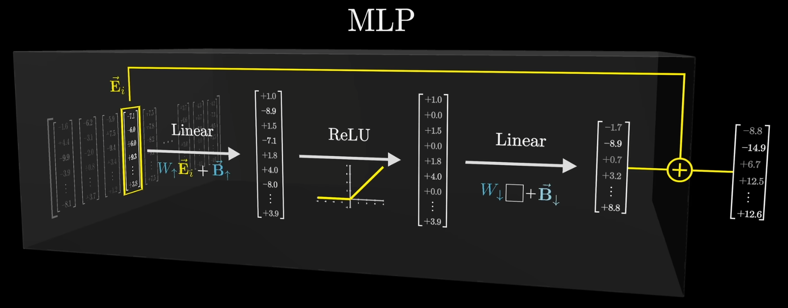
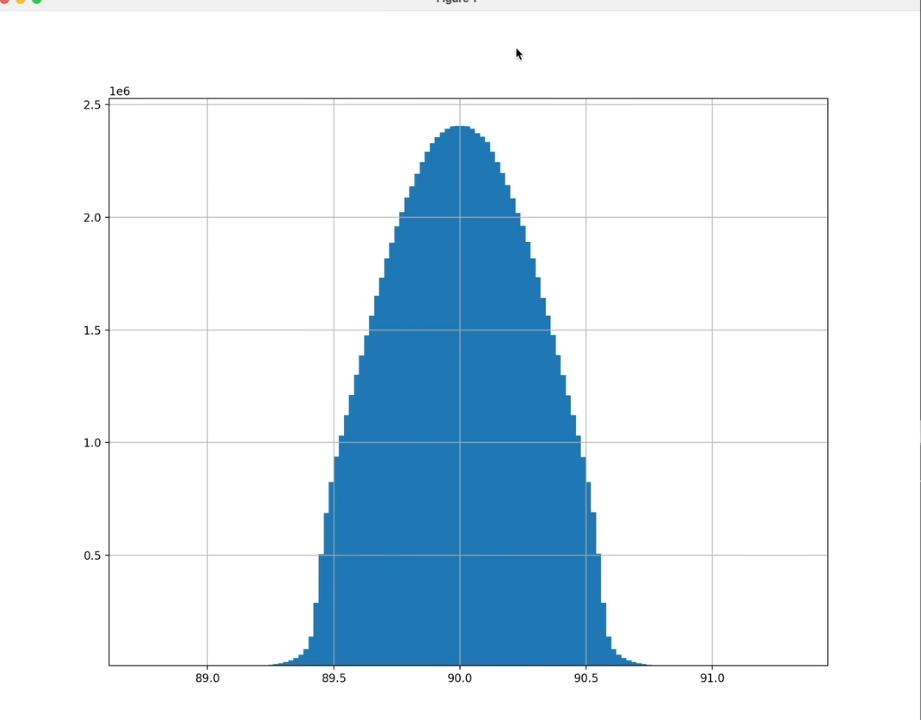

# Transformer

谷歌在2017年推出的原版Transformer专注于将一种语言的文本翻译成另一种。而我们要关注的变种，即用于构建ChatGPT等工具的模型，则是输入一段文字，甚至一些图片或语音，来预测出后文的内容。其结果展示为不同文本片段的概率分布，并选择概率较高者输出。

给他一个原始片段，从它给出的概率分布中取一个片段追加到文本末尾，再用所有文本进行新一轮的预测。这个重复预测和抽样的过程正是ChatGPT或其他大语言模型进行交互时遇到的。

>GPT:Generative Pre-trained Transformer

## 结构总览

首先，输入内容会被切分为许多小片段token，它们可以是单词，单词片段，或者某个符号。每个token都对应一个向量，这个向量设法编码这个token的含义。如果将向量视为高位空间的坐标，那么意思相近的词，对应的向量也往往相近。

这些向量随后经过**注意力模块**处理，这使得向量能够相互交流，通过互相传递信息来更新自己的值。比如机器学习中的model一词和时尚杂志中的model一词明显有不同含义，注意力机制需要找出上下文中的哪些词会改变哪些词的含义，以及将他们更新为什么含义。这种含义已经通过某种形式完全的编码进了向量中。

随后，这些向量会经过另一种处理。根据不同资料，有些会叫他**多层感知器**MLP，在这个阶段向量不再相互交流，而是并行的接受同一种处理。在这个阶段更像是询问每个向量一些问题，并根据这些问题的答案来更新向量。

随后重复这个过程，令注意力模块与MLP模块层层堆叠，我们的目标是让整段文字的所有关键含义都以某种方式融入到序列的最后一个向量。我们最后对最后这一个向量进行某种操作，得到所有可能的token概率分布。

只要你能够根据初始文本预测下一个词，那么你就可以反复进行预测，抽样，追加的过程套娃生成一大堆。

---

GPT-3使用了 *175,181,291,520* 个参数，可以被组织为 *27,938* 个参数矩阵。这些矩阵又分为八类。我们需要了解不同类型矩阵的作用。

## Embedding

在分割token时，模型拥有一个预设的词汇库，包含所有可能的词汇。我们将遇到的第一个矩阵叫做**嵌入矩阵**(Embedding Matrix)，每个词都对应一列，这些列向量决定了每个token对应的向量，我们将其记为 $W_E$ 。它的初始值随机，就和其他矩阵一样，但将基于数据学习。

早在transformer之前，将单词转化为向量就是机器学习中的常见做法。我们通常称token**嵌入**(embedding)向量vector，这让你倾向于从**几何角度**理解他们。

当模型在训练阶段调整权重，确定不同单词该如何嵌入向量时，他们最终的**嵌入向量**在高维空间中的**方向**往往具有某种**语义**意义。

如果你取女人和男人的向量之差 $E(woman) - E(man)$ 并将其视为一个空间中的小向量，这个向量差将与女王与国王的向量之差 $E(queen) - E(king)$ 非常相似。假如你不知道 $E(queen)$ ，那么你可以令 $E(queen) \approx E(king)+E(woman)-E(man)$ ，理论上这是可行的。

$ E(\text{Hitler})+E(\text{Italy})-E(\text{Germany}) $ 很有可能得到 $E(\text{Mussolinis})$，就好像模型学会了将某个方向与国家联系起来，另一个方向与二战领导人联系起来一样。

两个向量的点积可以视为衡量他们对齐程度的一种方法。如果向量方向接近，点积为正，正交则为0，反向则为负。这可以用来衡量两个token的关联程度。

---

一个嵌入向量不仅编码了一个token，也编码了token的位置信息。更值得注意的是，这些向量能结合上下文语境。比如一个token的嵌入向量可能被网络中的各个模块相互拉扯，最终指向一个更具体细致的方向。

在一开始根据输入文本建立向量组时，每个向量都是直接从嵌入矩阵中拉出来的，此时他们只是编码，而没有上下文信息。而Transformer的主要目标就是让这些向量能够获得比单个token更丰富具体的含义。 

这种网络一次只能处理特定数量的向量，叫做他的上下文长度。GPT-3的上下文长度为2048，即2048列token，每列有12000维。上下文长度限制了Transformer在预测下一个词时能够结合的文本量。

## Unembedding

上下文中的最后一个向量，将被映射到一个列表，每个值对应词库中的一个token。 这个用来映射的矩阵叫做**解嵌入矩阵**(Unembedding Matrix)，每一列对应一个嵌入维度。

他的行列与嵌入矩阵对调，我们记作 $W_U$，也在训练中学习。最后其输出经过softmax归一化，得到一列token的概率分布。

在softmax输出时，我们也会做一些特殊处理。

\[
    Softmax(x_i) = \frac{e^{x_i/T}}{\sum_{n=0}^{N-1}e^{x_n/T}}
\]

我们有时会加个分母T，称**温度**。当T较大时，他会给低值赋予更多权重，使分布更均匀。如果T较小，那么意味着所有权重都给到最大值。

如果T=0，意味着模型总是选择概率最大的token。而一个更大的T意味着模型愿意选择可能性较低的词，让他更新颖，也更有风险，容易说胡话。API通常不会让你使用超过2的温度。

## Attention

Embedding将嵌入向量嵌入高维空间，对应某种语义。Transformer的目标是逐渐调整这些嵌入，使其融入更丰富的上下文语义。
一个训练的好的注意力模块能够计算出，给初始由token得到的嵌入向量加个什么向量，使其移动到上下文对应的具体方向上。注意力模块允许模型相互传递这些嵌入向量所蕴含的信息。
而新嵌入向量的信息，可以比单个token更加丰富。

在注意力模块与MLP的套娃后，最后一层经过softmax输出概率分布时，其完全基于序列中的最后一个向量。最后一个向量必须经过所有注意力模块的更新，来包含整个上下文窗口。

### 单头注意力 Single head Attention

嵌入向量编码了token的含义与位置信息，和上下文没有关联，记为 $\vec{E}$，我们的目标是经过一系列计算，产生一组新的更精准的嵌入向量 $\vec{E}'$。
模型的实际行为往往是很难解释的，因为它只是通过调整大量参数来最小化某个函数，但为了方便解释，我们以名词与形容词为例进行说明：

每个名词都在询问：我前面有形容词吗？这样的询问被编码为另一个向量，称这个词的**查询**(query)。它的维度通常更小。

要计算一个查询向量，需要先取一个矩阵 $W_Q$， 由$ W_Q \vec{E_i} = \vec{Q_i}$。查询矩阵与文中所有的嵌入向量相乘，给每个token都计算出一个查询向量。

>查询矩阵的具体行为是从数据中习得的。实际来看，这个矩阵的作用非常难以解释。我们可以假设这个查询矩阵，将嵌入空间中的名词映射到较小的查询空间中的某个方向，用向量来编码“寻找前置形容词”这样的概念。

与此同时我们需要另一个矩阵，**键矩阵**(Key Matrix)，$W_k$ 与嵌入向量相乘，得到一系列 $\vec{K_i}$。从概念上讲，可以把键视为想要回答查询。
和查询矩阵一样，它将嵌入矩阵映射到较小的键空间，当查询与键的方向相对齐，我们认为他们相匹配。

为了衡量键与查询的匹配程度，我们需要计算两两点积，其值越大，则键与查询越对齐。用机器学习的术语来说，若点积较大，意味着前面token的嵌入**注意**到(attend)后面token的嵌入。

---

同一列token序列对应同样多的key向量与query向量，形成一个由其点积构成的方阵。这个点积的大小表示每个词语其他词的含义的相关性。

这些点积的用法是对某一列嵌入向量进行加权求和，得到一个权重，称**相关性**。

这样一来，数值就不能是正负无穷，而要介于0和1之间，而且每一列查询的加和为1。
因此对于每一列查询所对应的点积，我们将其投入softmax进行归一化，此时我们得到的介于0~1之间的数值，就可以看做权重，表示当前查询与若干个key的相关度。

现在得到的网格被称为**注意力模式**(attention pattern)

Transformer的论文中有一个简洁的写法：

$$
Attention(Q,K,V) = softmax(\frac{QK^T}{\sqrt{d_k}})V  
$$

这里的Q与K，包含了所有的query向量和key向量。由于原论文使用行向量，所以转置放在K上，但你只需要知道分子所得到的正是点积矩阵。
为了数值的稳定性，建议所有的点积除以key-query空间维度的平方根来平滑概率分布，以防止概率分布被拉扯成极值。

>一个技术细节
>在训练过程中，对给定示例跑模型的时候，模型会根据正确预测出下一词的概率高低进行奖惩并调整权重。
>而一个效率更高的做法是，在预测下一个词是什么的同时，也让他预测每个token子序列之后所有可能的下一个token。
>这样一个训练实例就能提供更多次训练机会。

就注意力机制而言，这意味着不能让后一个词影响前一个词，不然就会泄露答案。所以我们希望后方token影响前方token的点积能够被置为0。

为了仍然保证归一化性质，常见的方法是在softmax之前将其设为负无穷，再由softmax转化为0.
这一过程即**掩码**(masking)。有的注意力机制也不使用掩码。

关于注意力模式，值得一提的是，它的大小是**上下文长度的平方**。
这也是为何上下文长度会成为瓶颈。近年来，注意力机制出现了一些变体，旨在使上下文更具拓展性，但他们不在本次讨论范畴。

---

现在该更新嵌入向量了，把每个token的信息传递给与之相关的其他词。

这需要用到第三个矩阵，**值矩阵**(Value Matrix)，$W_V$。值矩阵乘以嵌入向量，得到**值向量** $\vec{v}$，作为你要给后词的嵌入所加的向量。因此这个值向量与嵌入向量位于同一个高维空间。

你可以将这个变换理解为：如果这个词需要调整目标词的含义，对目标词的嵌入需要加上什么向量。

现在，由嵌入向量你可以得到一系列值向量，我们由点积得到一系列权重。我们进行加权求和，得到原嵌入向量的变化量，记为 $\Delta E$。

$$
\vec{E_i}' = \vec{E_i} + \Delta \vec{E_i}
$$

将其加在嵌入向量上，完成更新，预期得到一个更精准的向量。

---

这一系列过程就是单头注意力机制。这个过程由三种充满了可调参数的矩阵实现： $W_Q,W_K,W_V$

### 多头注意力 Multi-headed Attention

Transformer内完整的注意力模块，由**多头注意力**(multi-headed attention)组成，大量并行地执行这些操作。每个头都有不同的K，Q，V矩阵。

$$
\vec{E_i} + \sum_{j=0}^{95}  \Delta \vec{E_i}^{(j)}
$$

GPT-3每个模块内使用96个注意力头，这意味这有96种不同的K，Q，V矩阵，产生96种不同的注意力模式。你要做的就是把每个头的变化量一起加到嵌入向量上。 

>目前我们讨论的都是**自注意力**(self attention)头
>这与其他模型中的变体**交叉注意力**(cross-attention)头有所区别。交叉注意力通常会处理两种不同类型数据，比如原文与译文，语音音频与转录文字。
>唯一的区别在于交叉注意力的 key-query 矩阵作用于不同的数据集。比如key可能来源于一种语言，query来源于另一种。此时通常不会使用掩码，因为不需要考虑后影响前。

通常而言，值矩阵的参数量等于键矩阵和查询矩阵之和，这有助于并行运行多个**注意力头**(attention head)。其具体做法是，将值矩阵分解为两个小矩阵相乘以降低复杂度，在线性代数上，这种操作叫做**低秩分解**(low rank transformation)。

**3b1b**将这两个分解出来的矩阵称为**值↑矩阵**与**值↓矩阵**(value Up/Down matrix)，不同的论文里会有不同的称呼。从概念上讲，我们仍把这两个矩阵视为一个线性变换。

右面这个行少的矩阵，其行通常等于key-query查询空间的维我们将其看作是将一个较大的嵌入向 量，降维到较小的空间，即*Value Down Matrix*。左侧的矩阵，则将其从小空间映射回嵌入空间，得到用于实际更新的向量，即*Value Up Matrix*。

这些值↑矩阵，有时会合并在一起，称**输出矩阵**(output matrix)，与整个多头注意力模块相关联。而单个注意力头的值矩阵，则单指第一步的矩阵，即将嵌入向量投影到低纬度空间的**值↓矩阵**。

## MLP

模型参数的大部分其实存在于MLP中。有理论认为，他们提供了额外的容量来存储事实。

每个token对应的向量都会通过一系列操作，得到一个维度相同的向量。得到的向量应与原本的向量相加，其结果就是输出值。这个操作会对每一个向量并行执行，向量之间不会相互交流。

---

我们使用“田所浩二24岁”这一事实举例，先对高维空间做一些假设。

首先假设一个方向代表“姓是田所”，另一个几乎与之垂直的方向代表“名叫浩二”。最后一个方向代表“24岁”。

我们从神经网络中提取一个正在处理的向量 $\vec{E}$，如果其与“姓是田所”方向的点积为1，就说明这个向量编码了一个姓叫田所的人。否则，点积为0，或者负数，说明该向量与该方向不一致。此时我们暂且忽略点积大于1。

那么假设一个向量代表全名为“田所浩二”，则它与这两个方向的点积都必为1。

---

第一步，我们需要使用一个矩阵与向量相乘。这很常见，这毕竟是深度学习。这个矩阵同样由训练得来，我们仍视其为一堆可调参数构成的矩阵。

$$
\begin{bmatrix}
——\vec{R_0}——\\
——\vec{R_1}——\\
...       \\
——\vec{R_n}——
\end{bmatrix}
\cdot
\vec{E} = 
\begin{bmatrix}
\vec{R_0}·\vec{E} \\
\vec{R_1}·\vec{E} \\
...               \\
\vec{R_n}·\vec{E} \\
\end{bmatrix}
$$

不过我们可以视这个矩阵由行向量构成，这样一来其我们将得到若干行向量与嵌入向量的点积组成的新向量。

假设这个矩阵的第一行刚好是“姓是田所”这一方向，而 $\vec{E}$ 编码了“姓是田所”，则输出向量的第一个分量，即两者点积为1.否则，为0或负数。

更复杂一点，如果第一行同时表示“姓是田所”，“名是浩二”，我们将其记为 $\vec{TS} + \vec{HE}$，那么它与嵌入向量做点积，得到 $\vec{TS}·\vec{E} + \vec{HE}·\vec{E} = 2$。

这只是矩阵的一行，你也可以想象其他行同时在并行的询问这种问题，探查嵌入向量的其他各类特征，比如它是不是24岁。矩阵的总行数，可以被看做提问的数量。GPT-3中，这一数字为49,152，嵌入空间维度的4倍(整数倍对硬件友好)。

考虑到这一充满了权重的矩阵将向量映射到更高维的空间，我们记作 $W_\uparrow$
这一步还通常在输出中加入另一个向量，也由学习得出，成为**偏置**(Bias)，记作 $B_\uparrow$

$$
W_\uparrow·\vec{E} + \vec{B}_\uparrow
$$

这一步骤可以被这样描述，它是纯**线性**的，而语言是高度**非线性**的过程。如果“田所”和“浩二”的测度过高，他也可能被其他名字所触发。

---

下一步是让这个大的过程向量通过一个简单的非线性函数：**ReLU**，让负值映射为0.ReLU的全称叫线性整流函数/线性修正单元(Rectified Linear Unit)。

之前我们要求点积要么是1，要么为0或负数，那么它通过ReLU后就非常整洁，因为所有负值和0都被截断为0。某种意义上，他模仿了**与门**的行为模式。(即如果与事实相关则为1)很多模型会用一个稍作修改的函数**GELU**，高斯误差线性单元，基本形状相同，但是更加平滑。

---

下一步和第一步很相似，左乘一个超大矩阵，再加一个偏置，此处输出向量的维度降低回到嵌入空间的维度。我们暂时称这个大矩阵为"降维投影矩阵"(Down Projection)。暂时记为 $W_\downarrow$ 和 $\vec{B}_\downarrow$

此时我们切换成列来考虑这个矩阵。

$$
\begin{bmatrix}
|&|&  &|\\
\vec{C_0} &\vec{C_1} &...&\vec{C_m}\\
|&|&  &|
\end{bmatrix}
\cdot
\begin{bmatrix}
    n_1\\
    n_2\\
    ...\\
    n_m
\end{bmatrix}+
\begin{bmatrix}
|\\
\vec{B}\\
|
\end{bmatrix}
$$

那么其乘积则表示各列向量对处理向量各分量的加权累加：

$$
n_1\vec{C_1} + n_2\vec{C_2} + ... + n_m\vec{C_m}
$$

之所以这么考虑，是因为此时列向量与嵌入空间的维度相同，因此我们可以将其视为该空间中的方向。

比如我们将第一列视作“24岁”方向，这意味着如果处理向量的第一个神经元被激活为为1(经过了ReLU处理)，即如果 $n_0$ 为1，那么这个列向量就会被加入到结果。反之若为0，那么这一列不会造成影响。

类似的，单独一列向量也可以是多个拥有不同含义、不同方向的复合。矩阵的其他列会说明，如果对应的神经元活跃，那么结果中加入哪些信息。

而偏置即无论如何都要加入的那个向量。和这些充满了参数的矩阵一样，难以解释。也许是网络需要做一些记账工作，大可以先忽略这一问题。

$$
W_\downarrow \square + \vec{B}_\downarrow
$$

这便是这个步骤的简易表示。

---

经过了这三个步骤，我们将结果与最开始的输入向量加和，得到最后的输出。通过两个矩阵乘法，每个都带一个偏置，以及一个简单的ReLU截断函数。

假设输入向量编码了“田所”和“浩二”，由于这一系列运算将触发与门逻辑，他会被加上一个“24岁”方向，输出结果会编码所有这些信息。

就大语言模型中的Transformer而言，这只是更大型架构中的一部分。任何试图解释其在做什么的尝试，都与将信息编码进高维嵌入向量的想法密切相关。

## J-L引理与可解释性

你可能在思考，上文所探讨的简化例子，是否真实反映了事实在大语言模型中的存储方式？

一个矩阵的行可以被视为嵌入空间中的方向，对应一系列神经元的激活，说明给定向量与特定向量的一致程度。
第二个矩阵中的列，说明若该神经元被激活，该在结果添加什么信息。

这两点都是数学事实。而证据表明，单个神经元几乎不会代表单一特征，理由甚至非常充分。这与当今可解释性研究人员中流传的一种概念有关，称作**叠加**(Superposition)。这个假设有助于解释为什么模型难以解释。

其基本思想是，在一个N维空间中，若想用一堆正交基来表示各种不同的特征，我们只能表示N条，即空间的维度。

但有趣之处在于，我们放宽一些限制，容忍一些噪声，比如允许这些特征对应的向量并不完全正交，而是近似正交，比如我们允许89°~91°。若是在三维或者二维空间中，这没有什么区别，几乎没有额外空间容纳更多的向量。而高维空间中则相反，非常的反直觉。

生成10000个100维向量取随机值，衡量两两向量之间的角度。由于角度为0°~180°，由大数定律可知我们将得到一个聚集在期望90°的分布。经过试验，即便是随机向量，这也会拥有一个90°左右的大偏差。

接下来对他们执行一些优化，使得两两之间的角度尽可能靠近90°。重复多次实验后，其角度分布如图，所有可能向量对之间的角度都在89°到91°之间。
这意味着放宽约束带来的那么点地方能容纳比预期多得多的近似正交的向量。

通常来说，**约翰逊-林等斯特劳斯引理**(Johnson–Lindenstrauss,JL Lemma)的一个结果是，能在空间中塞进几乎垂直的向量数量，随维度指数增长。

这对大语言模型意义重大，能将相互独立的概念与几乎垂直的向量相关联而受益。

这意味着能在有限的空间维度中，存储数量多得多的各种概念。这也部分解释了为什么模型性能随规模扩大而显著提升。一个有着10倍维度的空间，能存储远超10倍的独立概念。

>之所以强调正交，是因为正交的越多，越能表示独立的，不同的概念与特征。正交的少，意味着大多数都是相关的概念，独立性弱。

这也意味着，以GPT-3的规模，其探测的特征远不止50000个，而是利用空间中几乎垂直的方向大幅度扩充了容量，大幅度提升了探测的特征数。

若真是这样，也意味着单个特征并不会如神经元激活状态一般清晰可见，而会是某种特定的神经元组合，一种**叠加**。多个近似正交的基将被组合，来生成更复杂，远超维度的高阶特征。

>了解更多可以搜索：稀疏自编码器(Sparse Autoencoder)
>一些可解释性研究人员用来尝试提取真实特征的工具，哪怕他们在神经元上高度叠加。