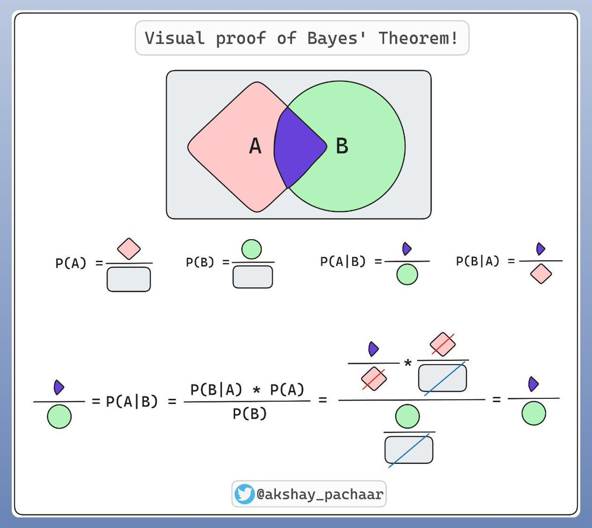

# Probability Theory

## 贝叶斯公式 Bayesian Formula

\[ P(B|A) = \frac{P(A|B) P(B)}{ P(A)}\]

关于贝叶斯的更普遍的情况是，你有一些假设(Hypothesis)，你又获得了一些证据(Evidence)，你想知道在你获得的证据为真的前提下，你的假设成立的概率，即$P(H|E)$。也就是说，我们把考虑的情况限制在了E正确的条件下，这条竖线表明我们在讨论总概率空间中的一个有限部分。

假如人群中图书管理员与农民的比例为1:20，你听说某个人温文尔雅，符合图书管理员的特征，此为证据。现在猜测这个人是图书管理员的概率，此为假设。

- 在不考虑证据时，$P(H) = 1/21$，这个概率叫做**先验概率**，它来源于人群比例。
- 随后我们考虑图书管理员中符合证据的比例，比如是0.4，即$P(E|H) = 0.4$，此为假设成立时看到证据的概率。这个概率叫做**似然概率**(likelihood)

则：
\[ P(H|E) = \frac{P(H)P(E|H)}{P(H)P(E|H) + P(\neg H)P(E|\neg H)}  = \frac{P(H)P(E|H)}{P(E)} \]

这个长分母包含两个部分，一个为假设成立，并看到证据的概率，与假设不成立，看到证据的概率。他们合在一起，即看到证据的概率 $P(E)$

---

我们实际上是在用E，新的证据，来更新我们先前的假设先验概率，而得到一个后验概率。

你拥有一个先验概率，它在整体概率空间中占据一个部分。而当你看到了证据，概率空间就被限制了。

而证据对概率空间的限制同时作用于假设成立、与假设不成立两部分，因为同样的描述可以同时作用于农民和图书管理员。因此我们要做的是同时考虑这两部分，并从中挑出我们需要的。贝叶斯公式量化了这个过程。

--- 

从这个角度看，贝叶斯公式实则描述的是一个比例关系。信息削除了概率上的不确定度，而贝叶斯公式描述了削除后的比例关系。
**后验概率** $P(H|E)$ 更新自先验概率 $P(H)$ ，在比例上等于
\[ \frac{符合假设中符合证据的部分}{所有符合证据的部分} = \frac{P(H)P(E|H)}{P(E)} \]

其证明可以画个图用几何方法。