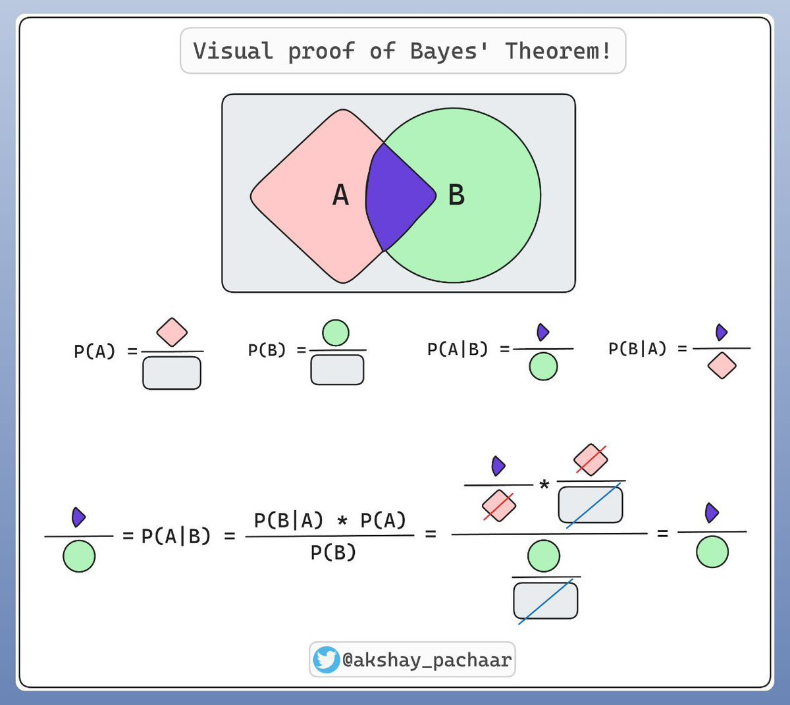

# 知识补充

## 贝叶斯公式 Bayesian Formula

\[ P(B|A) = \frac{P(A|B) P(B)}{ P(A)}\]

关于贝叶斯的更普遍的情况是，你有一些假设(Hypothesis)，你又获得了一些证据(Evidence)，你想知道在你获得的证据为真的前提下，你的假设成立的概率，即$P(H|E)$。也就是说，我们把考虑的情况限制在了E正确的条件下，这条竖线表明我们在讨论总概率空间中的一个有限部分。

假如人群中图书管理员与农民的比例为1:20，你听说某个人温文尔雅，符合图书管理员的特征，此为证据。现在猜测这个人是图书管理员的概率，此为假设。

- 在不考虑证据时，$P(H) = 1/21$，这个概率叫做**先验概率**，它来源于人群比例。
- 随后我们考虑图书管理员中符合证据的比例，比如是0.4，即$P(E|H) = 0.4$，此为假设成立时看到证据的概率。这个概率叫做**似然概率**(likelihood)

则：
\[ P(H|E) = \frac{P(H)P(E|H)}{P(H)P(E|H) + P(\neg H)P(E|\neg H)}  = \frac{P(H)P(E|H)}{P(E)} \]

这个长分母包含两个部分，一个为假设成立，并看到证据的概率，与假设不成立，看到证据的概率。他们合在一起，即看到证据的概率 $P(E)$

---

我们实际上是在用E，新的证据，来更新我们先前的假设先验概率，而得到一个后验概率。

你拥有一个先验概率，它在整体概率空间中占据一个部分。而当你看到了证据，概率空间就被限制了。

而证据对概率空间的限制同时作用于假设成立、与假设不成立两部分，因为同样的描述可以同时作用于农民和图书管理员。因此我们要做的是同时考虑这两部分，并从中挑出我们需要的。贝叶斯公式量化了这个过程。

--- 

从这个角度看，贝叶斯公式实则描述的是一个比例关系。信息削除了概率上的不确定度，而贝叶斯公式描述了削除后的比例关系。
**后验概率** $P(H|E)$ 更新自先验概率 $P(H)$ ，在比例上等于
\[ \frac{符合假设中符合证据的部分}{所有符合证据的部分} = \frac{P(H)P(E|H)}{P(E)} \]

## 似然 Likelihood

likelihood在英文上与概率为近义词，而统计学家费舍尔特意选用likelihood一词，与probability划清界限。这一术语的创造，标记着统计学从描述性数学向推断性哲学的跃迁。

概率已知参数，预测未知数据。而似然是已知观测数据，未知参数。

---

- 这是一个概率问题：已知有猫在房间里，玻璃杯碎的概率有多大？即计算 $P(碎玻璃|有猫)$
- 这是一个似然问题：观测到碎玻璃，房间里有猫的似然概率有多大？即计算 $P(有猫|碎玻璃)$

**最大似然估计**(maximum likelihood estimation) 即通过观测数据反推模型参数的核心方法。其核心思想即：在众多可能的参数中，选择让已观测数据看起来最合理的参数。

---

假如你获得了一个抛硬币的实验数据：10次中有7次正面。你的目标是估计抛硬币后为正面的概率 $\theta$

1. 假设数据独立，按照分布写出似然函数 $L(\theta) = \theta^7(1-\theta)^3$
2. 为了方便运算取对数，$lnL(\theta) = 7ln\theta + 3ln(1-\theta)$
3. 求导求极值 $\frac{d}{d\theta} = \frac{7}{\theta} - \frac{3}{1-\theta} = 0$
4. 得到 $\hat{\theta}_{MLE} = 0.7$

我们通过求极值得到一个最大的似然概率，即，抛硬币为正面的概率的最大似然估计为0.7。
而显然抛硬币是一个五五开的游戏，这暴露了最大似然估计的一个问题：不考虑先验概率，只相信数据。在极端情况下你可以得到 $\hat{\theta} = 1$

--- 

在分类任务中常用的损失函数是**交叉熵损失函数**。**交叉熵**来源于信息论，用来度量两个概率分布的距离或差异。其通常形式为:

\[ L = - \sum_{i=1}^Ny_ilog(\hat{y_i}) \]

其中 $y_i$ 为真实数据，$\hat{y_i}$ 为预测值。而最小化L，即也是最大化似然的过程，以求得最佳参数。

## 交叉熵 Crossentropy

信息论的核心思想是量化数据中的信息内容。在信息论中，该数值被称为分布P的熵：

\[ H[P] = \sum_j -P(j)logP(j) \]

信息论基本定理之一指出，为了从分布P中随机抽取耳朵数据进行编码，我们至少需要 $H[P]$ nat进行编码。nat相当于bit，但是以e为底而不是2，因此一个nat是 $\frac{1}{log(2) }= 1.44bit$

---

预测和压缩有什么关系呢？如果你有一个要压缩的数据流，我们非常容易预测下一个数据，那么这个数据很容易压缩。举一个极端的例子，如果数据流中所有数据都相同，那么为了传递数据流的内容，我们不必传输任何信息。也就是说，对下一个数据的预测毫无信息量。

而如果我们不能完全预测每一个事件，我们就会觉得"惊异"。香农使用**信息量** $log \frac{1}{P(j)} = -logP(j)$ 来量化这种惊异程度。

当你观察一个事件j，并赋予它主观的概率 $P(j)$ ，这个概率越低，你的惊异就越大，这个事件的信息量也就越大。

所以**熵**，是当分配的概率真正匹配数据生成过程时的**信息量**的**期望**。

---

如果把熵 $H(P)$ 认为是"知道真实概率的人所经历的惊异程度"，那么交叉熵从 $P$ 到 $Q$ ，记为 $H(P,Q)$，我们认为是“主观概率为Q的观察者，在看到概率为P生成的数据时的预期惊异”。

当P=Q，交叉熵达到最低，从P到Q的交叉熵 $H(P,P) = H(P)$

在信息论的角度上看，交叉熵损失函数也基于最小化传达标签所需的惊异。