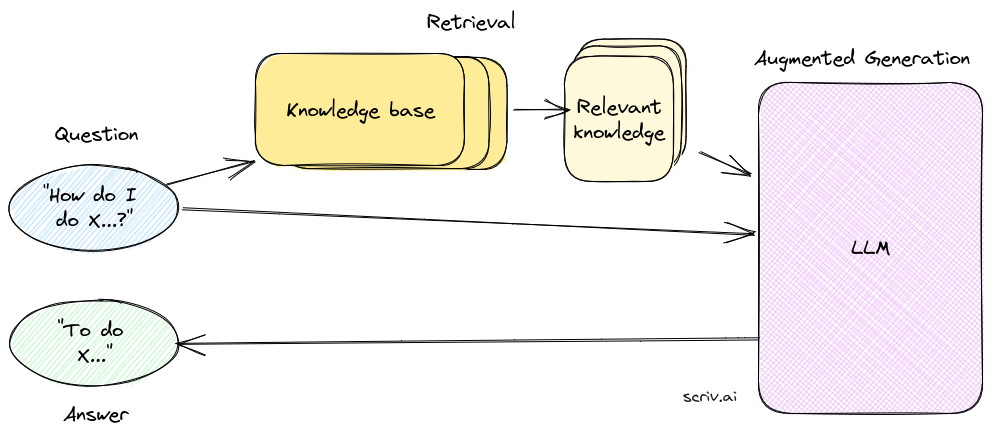
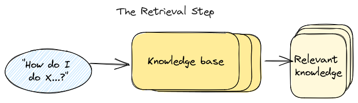
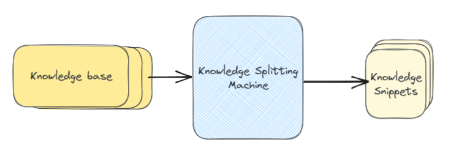
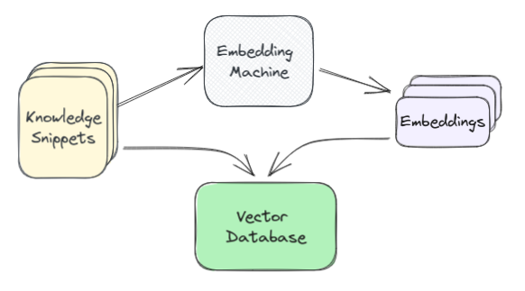
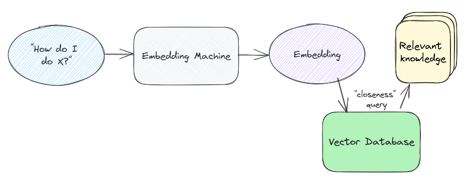
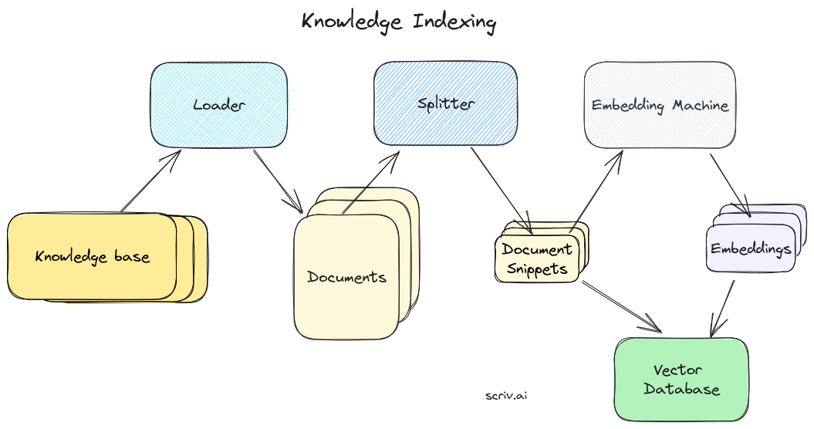
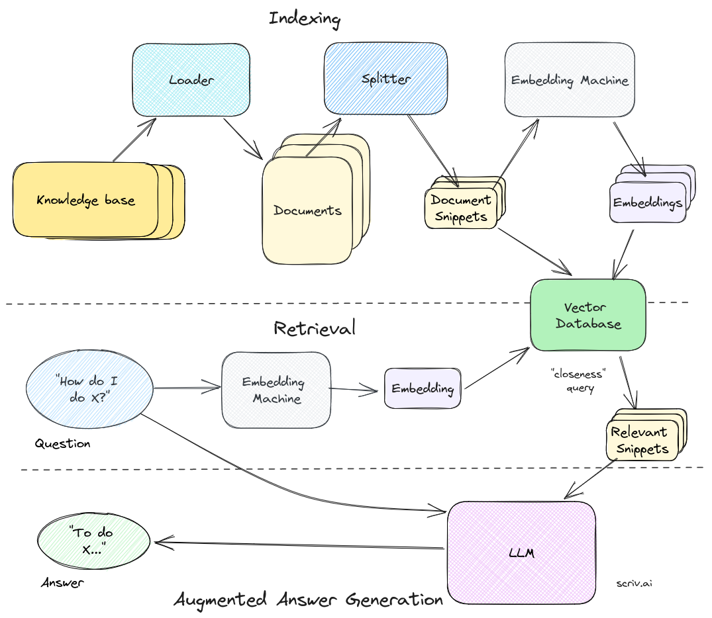

# Introduction to Retrieval Augmented Generation

>Retrieval augmented generation is the process of supplementing a user’s input to a large language model (LLM) like ChatGPT with additional information that you have retrieved from somewhere else



RAG,**检索增强生成**，即使用从其他资料检索到的额外信息来增强用户给大模型的输入。

整个过程的第一步是检索(retrieval)，这一步骤通过用户问题检索到与之最相关的知识。这一步在整个RAG工作链上最为重要，但目前不妨将其视为一个黑箱，只需知道它将返回与用户问题最相关的块(chunk)。

假如我们已经获得从信息库中检索到的最相关信息，该如何使用它增强LLM的回答呢？答案尤其简单，因为LLM只不过是一个语言模型，只需要'问'它即可——利用prompt和必要信息。

---

第一个部分是 *system prompt*，即给出一个全局的指导原则，常见的system prompt类似:
>"你是一个猫娘，你会被给予从知识库中提取出来的额外信息。利用他们回答问题。"

接下来我们给出AI需要的阅读材料。虽然当今的AI已经很智能了，但是我们仍可以在信息结构和格式上花些功夫。这是一个递交给LLM的文档范例：

```
------------ DOCUMENT 1 -------------

This document describes the blah blah blah...

------------ DOCUMENT 2 -------------

This document is another example of using x, y and z...

------------ DOCUMENT 3 -------------

[more documents here...]
```

实际上你可能并不需要这种格式化，但还是显式的表示出它们为好。你也可以用JSON,YAML等格式，又或者直接丢一大坨文本进去。但是在某些情境下保持格式的一致性仍然很重要，比如，你想要LLM给出其引用来源。

---

接下来要做的就只是把他们拼起来:

```
openai_response = openai.ChatCompletion.create(
    model="gpt-3.5-turbo",
    messages=[
        {
            "role": "system",
            "content": get_system_prompt(),  # the system prompt as per above
        },
        {
            "role": "system",
            "content": get_sources_prompt(),  # the formatted documents as per above
        },
        {
            "role": "user",
            "content": user_question,  # the question we want to answer
        },
    ],
)
```

就这样，给出system prompt,检索信息与用户问题，就可以得到一个特定内容的答案了。

我们还可以告诉AI在找不到答案时怎么做，我们可以在system prompt中加入相关的指示，告诉它拒绝回答，或者利用自己生成的知识，或者在给出答案时标注来源。

---

如何检索到相关信息呢？这便是retrieval步骤。



检索是一个搜索操作，我们希望基于用户输入找到最相关的信息。就好比搜索，有两个主要部分：

1. indexing 将信息转化为可被搜索/查询的内容
2. querying 检索出相关信息

值得一提的是，任何根据用户输入搜索的步骤都可以叫retrieval。比如根据用户输入上百度搜两个相关内容贴在input中也可以认为是retrieval。话虽如此，当今的RAG系统通常依靠**语义搜索**(semantic search)，使用另一项技术:embeddings

此处不多探讨嵌入，此前在词嵌入部分已详述过。只需知道它将信息变化为一个高维空间中的向量，其维度足够大以容纳足够丰富的语义，并让相近的向量尽可能的靠近。

此处，我们不针对token做嵌入，而是对整段文字做嵌入。

---



在indexing中，我们需要将知识库的内容拆碎成文本块(chunk)。这一步骤本身就是一个巨大的优化问题，暂且按下不表。一旦文章切好了片，将不同的片段送入嵌入模型，让他们给出高维向量表示，并将他们存入数据库。



由于向量的特殊性，我们需要使用特殊的数据库：向量数据库(vector database)

我们将用户输入做嵌入，并进行相似度处理，并在数据库中找到最相关的片段。这样，数据库就返回与input最相关的信息片段。



此处我们使用余弦相似度:
$$
cos\theta = \frac{a·b}{|a||b|}
$$

此处附点积相似度: $a·b = |a||b|cos\theta$

---



对知识库做indexing也是一个复杂的工作。它几乎是整个过程中最难的步骤。通常indexing分两步走:

1. Loading 从知识库中找到相关内容
2. Splitting 对内容做切片使其便于嵌入搜索

在技术上，loading和splitting区别不大，你也可以把他们视作一个步骤。LangChain采用loaders和splitters的实现方式，在底层概念上建立了抽象层。

在loader中，我们需要爬取所有页面，获取每一页的内容，把HTML转化为有用的文本格式，等等。这是一个几乎可以无限复杂的内容，但好在我们有库可以用。

当我们读取了一系列文档后，如果直接把他们传递给嵌入模型，其内容越多，嵌入信息就越不具体，相似度计算就会出问题。所以我们需要切片技术，把单篇文档切分为易于嵌入的碎片化的内容块。

给文档切片是门艺术。该切多大的片？如果太大，就不好匹配。如果太小，每一片就没有足够多的内容来生成回答。该如何切片？通过标题还是通过段落切片？等等诸如此类。不过合理的默认设置通常就足以把玩你的数据了。

---

整个RAG流程如图:

